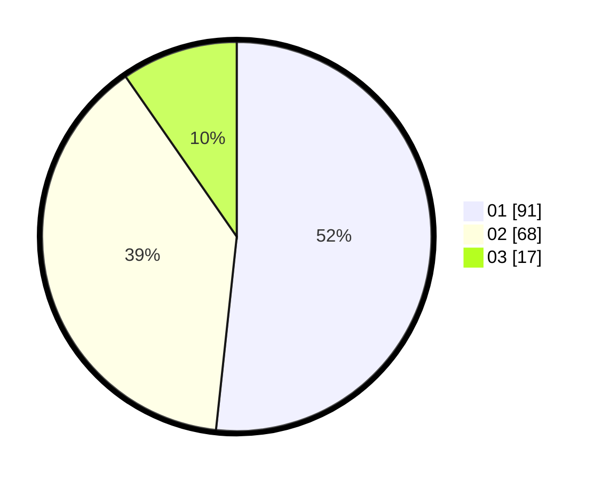

# Hasil

Hasil perolehan suara paslon dapat dilihat pada file paslon-01.txt, paslon-02.txt, dan paslon-03.txt.

Jika tidak ada, artinya data tersebut belum ada pada SIREKAP.

## Perolehan Suara

 * Paslon 01: **91**.
 * Paslon 02: **68**.
 * Paslon 03: **17**.

## Foto C Plano

https://sirekap-obj-formc.kpu.go.id/f0b8/pemilu/ppwp/31/75/06/10/01/3175061001110-20240214-190634--1fee025a-c231-40ce-893f-d90e6853cf6c.jpg

https://sirekap-obj-formc.kpu.go.id/f0b8/pemilu/ppwp/31/75/06/10/01/3175061001110-20240214-190448--10f0f932-fbfd-48ec-8b84-28173afc8d14.jpg

https://sirekap-obj-formc.kpu.go.id/f0b8/pemilu/ppwp/31/75/06/10/01/3175061001110-20240214-190550--2a5752f6-42ad-4f78-bfd2-cb10c0a798e4.jpg
