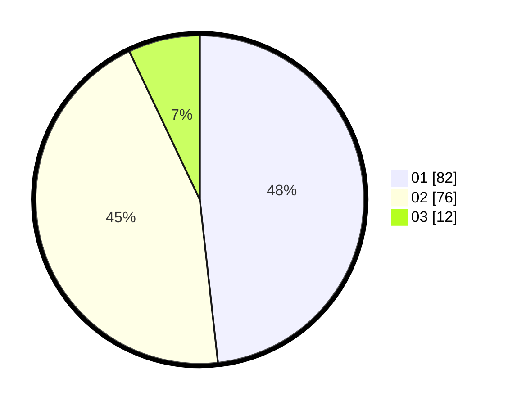

# Hasil

Hasil perolehan suara paslon dapat dilihat pada file paslon-01.txt, paslon-02.txt, dan paslon-03.txt.

Jika tidak ada, artinya data tersebut belum ada pada SIREKAP.

## Perolehan Suara

 * Paslon 01: **82**.
 * Paslon 02: **76**.
 * Paslon 03: **12**.

## Foto C Plano

https://sirekap-obj-formc.kpu.go.id/ca9b/pemilu/ppwp/31/75/06/10/01/3175061001111-20240214-155100--df1875ae-a7ee-4236-a10e-f0aab564de0d.jpg

https://sirekap-obj-formc.kpu.go.id/ca9b/pemilu/ppwp/31/75/06/10/01/3175061001111-20240215-005419--76ca85e9-414a-43a6-bbb3-8ef95da67ea8.jpg

https://sirekap-obj-formc.kpu.go.id/ca9b/pemilu/ppwp/31/75/06/10/01/3175061001111-20240215-005518--2af878ac-0b15-4e7e-8ff2-84bcf2f1ad52.jpg

## DATA PEMILIH TETAP

Jumlah pemilih dalam DPT: **239**.
 * L: **199**.
 * P: **120**.

## DATA PENGGUNA HAK PILIH

Jumlah pengguna hak pilih dalam DPT: **169**.
 * L: **83**.
 * P: **86**.

Jumlah pengguna hak pilih dalam DPTb: **2**.
 * L: **1**.
 * P: **1**.

Jumlah pengguna hak pilih dalam DPK: **1**.
 * L: **1**.
 * P: **0**.

Jumlah pengguna hak pilih: **172**.
 * L: **85**.
 * P: **87**.

## JUMLAH SUARA SAH DAN TIDAK SAH

JUMLAH SELURUH SUARA SAH: **170**.

JUMLAH SUARA TIDAK SAH: **2**.

JUMLAH SELURUH SUARA SAH DAN SUARA TIDAK SAH: **172**.
