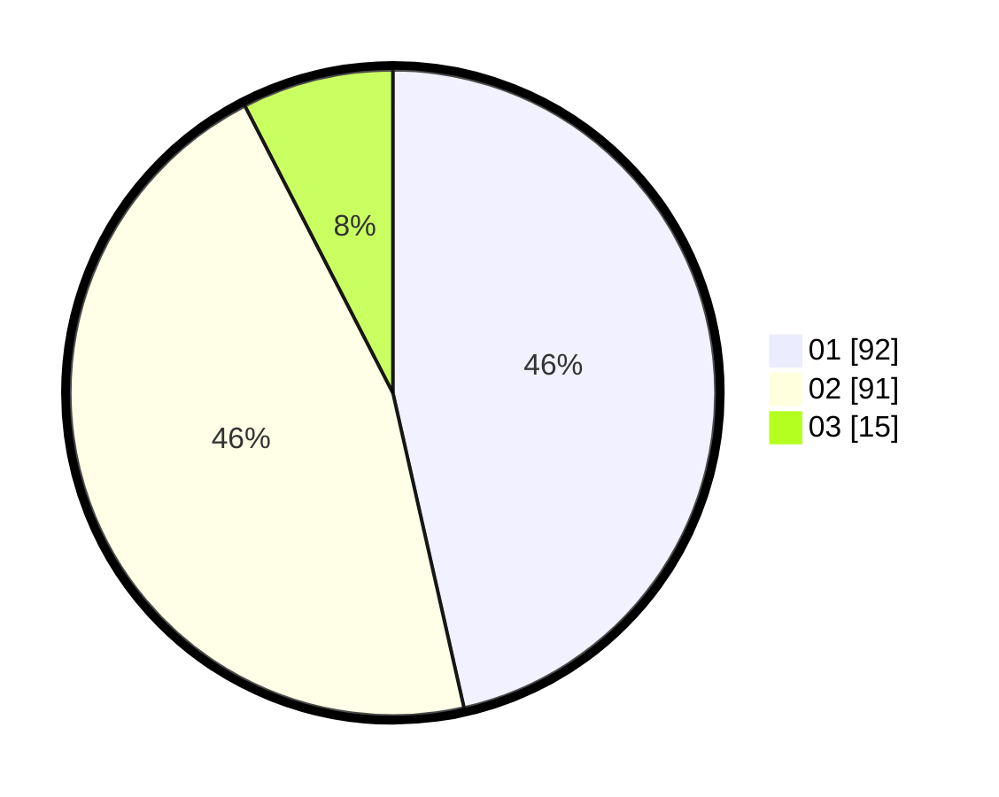

# Hasil

Hasil perolehan suara paslon dapat dilihat pada file paslon-01.txt, paslon-02.txt, dan paslon-03.txt.

Jika tidak ada, artinya data tersebut belum ada pada SIREKAP.

## Perolehan Suara

 * Paslon 01: **92**.
 * Paslon 02: **91**.
 * Paslon 03: **15**.

## Foto C Plano

https://sirekap-obj-formc.kpu.go.id/b602/pemilu/ppwp/31/75/06/10/01/3175061001112-20240214-204928--84f4c778-8614-4986-ba75-2c1b2340a265.jpg

https://sirekap-obj-formc.kpu.go.id/b602/pemilu/ppwp/31/75/06/10/01/3175061001112-20240214-205132--97387e69-217e-499c-bfa3-b9ef7f1082a1.jpg

https://sirekap-obj-formc.kpu.go.id/b602/pemilu/ppwp/31/75/06/10/01/3175061001112-20240214-220510--eab0b2d9-ff04-4f83-b9e2-53af31b571e1.jpg
