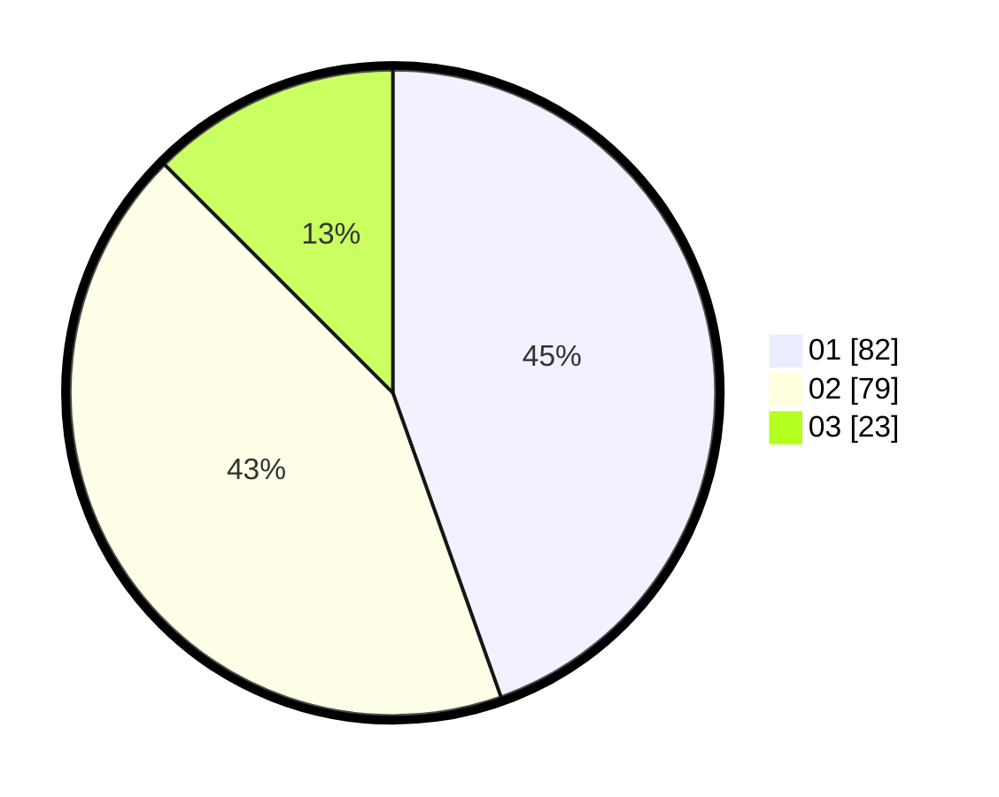

# Hasil

Hasil perolehan suara paslon dapat dilihat pada file paslon-01.txt, paslon-02.txt, dan paslon-03.txt.

Jika tidak ada, artinya data tersebut belum ada pada SIREKAP.

## Perolehan Suara

 * Paslon 01: **82**.
 * Paslon 02: **79**.
 * Paslon 03: **23**.

## Foto C Plano

https://sirekap-obj-formc.kpu.go.id/15ee/pemilu/ppwp/31/75/06/10/01/3175061001113-20240214-204917--c2193eb5-8ac2-4cda-9371-24d3f5830016.jpg

https://sirekap-obj-formc.kpu.go.id/15ee/pemilu/ppwp/31/75/06/10/01/3175061001113-20240214-205107--712c94de-439c-4b1a-8a93-bf29a14a7756.jpg

https://sirekap-obj-formc.kpu.go.id/15ee/pemilu/ppwp/31/75/06/10/01/3175061001113-20240214-205236--c1a9e5bd-997d-4d35-8989-ba1c524cd0a9.jpg

## DATA PEMILIH TETAP

Jumlah pemilih dalam DPT: **227**.
 * L: **112**.
 * P: **115**.

## DATA PENGGUNA HAK PILIH

Jumlah pengguna hak pilih dalam DPT: **183**.
 * L: **89**.
 * P: **94**.

Jumlah pengguna hak pilih dalam DPTb: **2**.
 * L: **0**.
 * P: **2**.

Jumlah pengguna hak pilih dalam DPK: **2**.
 * L: **2**.
 * P: **0**.

Jumlah pengguna hak pilih: **187**.
 * L: **91**.
 * P: **96**.

## JUMLAH SUARA SAH DAN TIDAK SAH

JUMLAH SELURUH SUARA SAH: **184**.

JUMLAH SUARA TIDAK SAH: **4**.

JUMLAH SELURUH SUARA SAH DAN SUARA TIDAK SAH: **188**.
