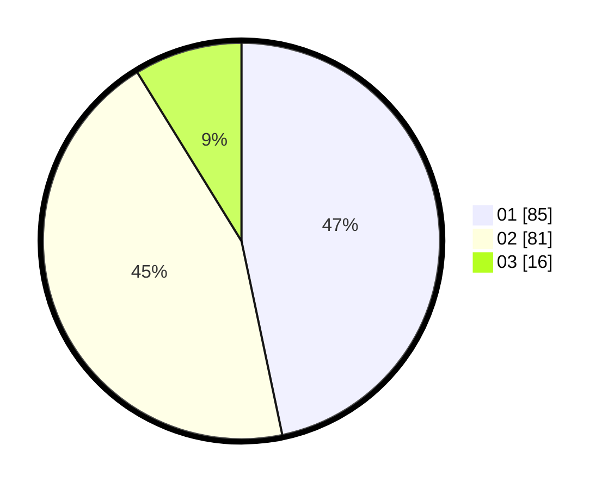

# Hasil

Hasil perolehan suara paslon dapat dilihat pada file paslon-01.txt, paslon-02.txt, dan paslon-03.txt.

Jika tidak ada, artinya data tersebut belum ada pada SIREKAP.

## Perolehan Suara

 * Paslon 01: **85**.
 * Paslon 02: **81**.
 * Paslon 03: **16**.

## Foto C Plano

https://sirekap-obj-formc.kpu.go.id/e8ec/pemilu/ppwp/31/75/06/10/01/3175061001114-20240218-102546--a814e4bd-989a-47e9-9fb1-0bf04e45b7d3.jpg

https://sirekap-obj-formc.kpu.go.id/e8ec/pemilu/ppwp/31/75/06/10/01/3175061001114-20240218-130737--b2851375-dede-4a3a-b606-1f99fa2033d6.jpg

https://sirekap-obj-formc.kpu.go.id/e8ec/pemilu/ppwp/31/75/06/10/01/3175061001114-20240218-130855--7be5a763-8ac7-480a-a42b-cb4eeced48f0.jpg

## DATA PEMILIH TETAP

Jumlah pemilih dalam DPT: **230**.
 * L: **110**.
 * P: **120**.

## DATA PENGGUNA HAK PILIH

Jumlah pengguna hak pilih dalam DPT: **181**.
 * L: **87**.
 * P: **94**.

Jumlah pengguna hak pilih dalam DPTb: **0**.
 * L: **0**.
 * P: **0**.

Jumlah pengguna hak pilih dalam DPK: **2**.
 * L: **1**.
 * P: **1**.

Jumlah pengguna hak pilih: **183**.
 * L: **88**.
 * P: **95**.

## JUMLAH SUARA SAH DAN TIDAK SAH

JUMLAH SELURUH SUARA SAH: **182**.

JUMLAH SUARA TIDAK SAH: **1**.

JUMLAH SELURUH SUARA SAH DAN SUARA TIDAK SAH: **183**.
