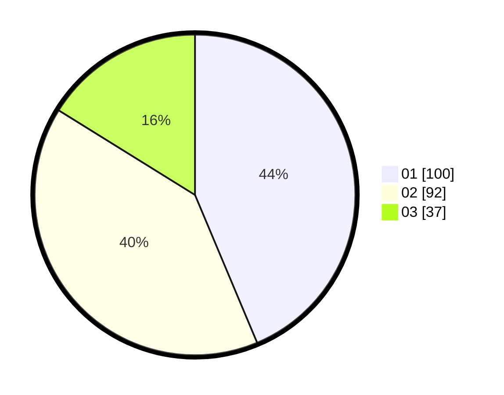

# Hasil

Hasil perolehan suara paslon dapat dilihat pada file paslon-01.txt, paslon-02.txt, dan paslon-03.txt.

Jika tidak ada, artinya data tersebut belum ada pada SIREKAP.

## Perolehan Suara

 * Paslon 01: **100**.
 * Paslon 02: **92**.
 * Paslon 03: **37**.

## Foto C Plano

https://sirekap-obj-formc.kpu.go.id/0a22/pemilu/ppwp/31/75/06/10/01/3175061001116-20240214-235043--b3c9ff99-00af-4064-828a-cc8252ef1180.jpg

https://sirekap-obj-formc.kpu.go.id/0a22/pemilu/ppwp/31/75/06/10/01/3175061001116-20240215-231113--4824714b-31d3-4d63-ad9f-2b523da03c56.jpg

https://sirekap-obj-formc.kpu.go.id/0a22/pemilu/ppwp/31/75/06/10/01/3175061001116-20240214-235120--540561c7-e367-4c7f-9689-f9924694c26c.jpg
