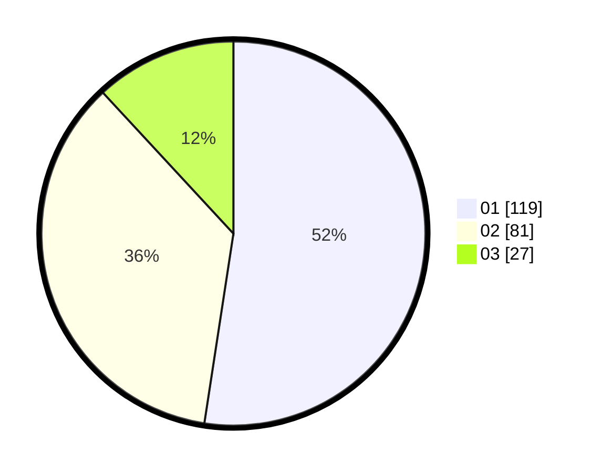

# Hasil

Hasil perolehan suara paslon dapat dilihat pada file paslon-01.txt, paslon-02.txt, dan paslon-03.txt.

Jika tidak ada, artinya data tersebut belum ada pada SIREKAP.

## Perolehan Suara

 * Paslon 01: **119**.
 * Paslon 02: **81**.
 * Paslon 03: **27**.

## Foto C Plano

https://sirekap-obj-formc.kpu.go.id/9d3b/pemilu/ppwp/31/75/06/10/01/3175061001120-20240214-212109--d35f45c7-c498-4462-b686-5e12ba87368c.jpg

https://sirekap-obj-formc.kpu.go.id/9d3b/pemilu/ppwp/31/75/06/10/01/3175061001120-20240214-212316--5fcef610-d7de-4cc3-9489-27b0fef28d2d.jpg

https://sirekap-obj-formc.kpu.go.id/9d3b/pemilu/ppwp/31/75/06/10/01/3175061001120-20240214-212432--50576d0a-0fdc-4dba-89f5-d40eb5fe7ba7.jpg

## DATA PEMILIH TETAP

Jumlah pemilih dalam DPT: **281**.
 * L: **147**.
 * P: **134**.

## DATA PENGGUNA HAK PILIH

Jumlah pengguna hak pilih dalam DPT: **226**.
 * L: **115**.
 * P: **111**.

Jumlah pengguna hak pilih dalam DPTb: **2**.
 * L: **1**.
 * P: **1**.

Jumlah pengguna hak pilih dalam DPK: **4**.
 * L: **2**.
 * P: **2**.

Jumlah pengguna hak pilih: **232**.
 * L: **118**.
 * P: **114**.

## JUMLAH SUARA SAH DAN TIDAK SAH

JUMLAH SELURUH SUARA SAH: **227**.

JUMLAH SUARA TIDAK SAH: **5**.

JUMLAH SELURUH SUARA SAH DAN SUARA TIDAK SAH: **232**.
