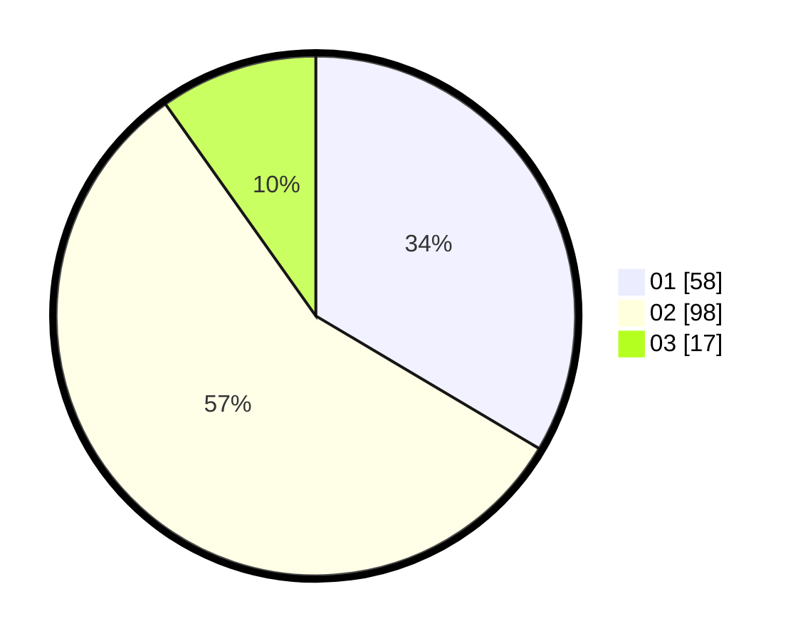

# Hasil

Hasil perolehan suara paslon dapat dilihat pada file paslon-01.txt, paslon-02.txt, dan paslon-03.txt.

Jika tidak ada, artinya data tersebut belum ada pada SIREKAP.

## Perolehan Suara

 * Paslon 01: **58**.
 * Paslon 02: **98**.
 * Paslon 03: **17**.

## Foto C Plano

https://sirekap-obj-formc.kpu.go.id/18da/pemilu/ppwp/31/75/06/10/01/3175061001121-20240214-160119--ff55427d-24a6-4e44-a092-8b595ac52e7e.jpg

https://sirekap-obj-formc.kpu.go.id/18da/pemilu/ppwp/31/75/06/10/01/3175061001121-20240214-184835--60ed9a14-6ca0-4f66-8747-14f1ceaac34f.jpg

https://sirekap-obj-formc.kpu.go.id/18da/pemilu/ppwp/31/75/06/10/01/3175061001121-20240214-184840--2f8f2fe7-c1d7-4a85-b60c-b40be828ea36.jpg

## DATA PEMILIH TETAP

Jumlah pemilih dalam DPT: **231**.
 * L: **125**.
 * P: **106**.

## DATA PENGGUNA HAK PILIH

Jumlah pengguna hak pilih dalam DPT: **231**.
 * L: **125**.
 * P: **106**.

Jumlah pengguna hak pilih dalam DPTb: **2**.
 * L: **2**.
 * P: **0**.

Jumlah pengguna hak pilih dalam DPK: **0**.
 * L: **0**.
 * P: **0**.

Jumlah pengguna hak pilih: **233**.
 * L: **127**.
 * P: **106**.

## JUMLAH SUARA SAH DAN TIDAK SAH

JUMLAH SELURUH SUARA SAH: **173**.

JUMLAH SUARA TIDAK SAH: **1**.

JUMLAH SELURUH SUARA SAH DAN SUARA TIDAK SAH: **174**.
