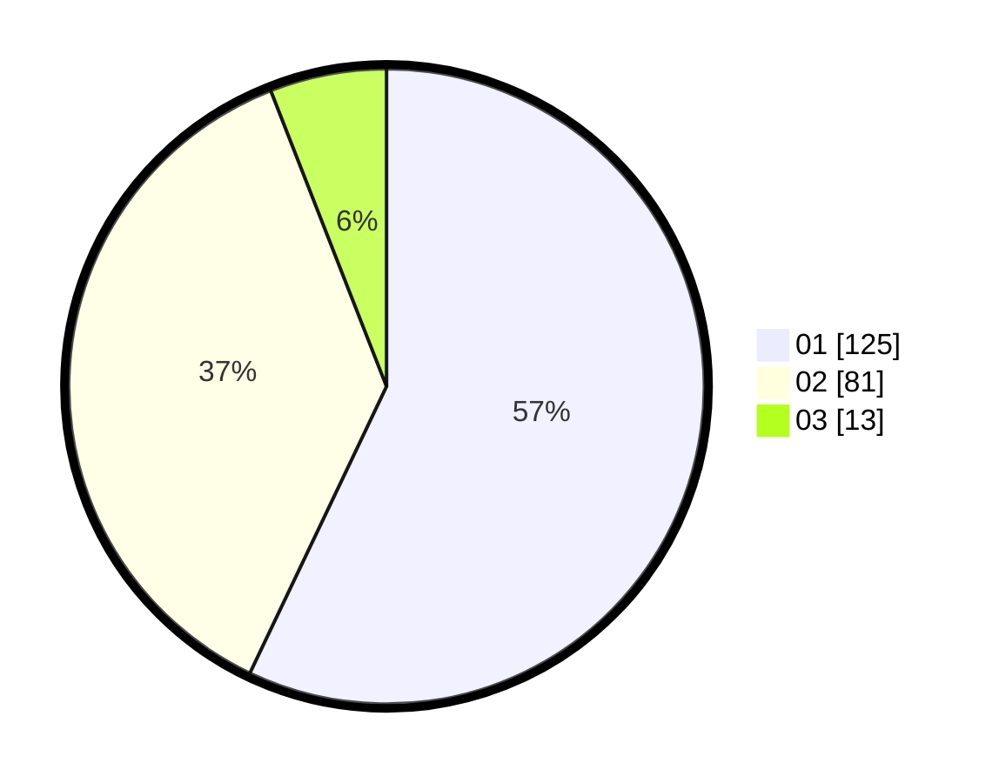

# Hasil

Hasil perolehan suara paslon dapat dilihat pada file paslon-01.txt, paslon-02.txt, dan paslon-03.txt.

Jika tidak ada, artinya data tersebut belum ada pada SIREKAP.

## Perolehan Suara

 * Paslon 01: **125**.
 * Paslon 02: **81**.
 * Paslon 03: **13**.

## Foto C Plano

https://sirekap-obj-formc.kpu.go.id/5f90/pemilu/ppwp/31/75/06/10/01/3175061001128-20240214-215346--94a089ea-fea1-4958-8eaa-69a95631fc99.jpg

https://sirekap-obj-formc.kpu.go.id/5f90/pemilu/ppwp/31/75/06/10/01/3175061001128-20240214-220714--ee69a195-5f02-4dd7-a517-7fb4cad7dec5.jpg

https://sirekap-obj-formc.kpu.go.id/5f90/pemilu/ppwp/31/75/06/10/01/3175061001128-20240214-200841--0146695f-b503-4420-b5c9-d23c8814afe2.jpg
