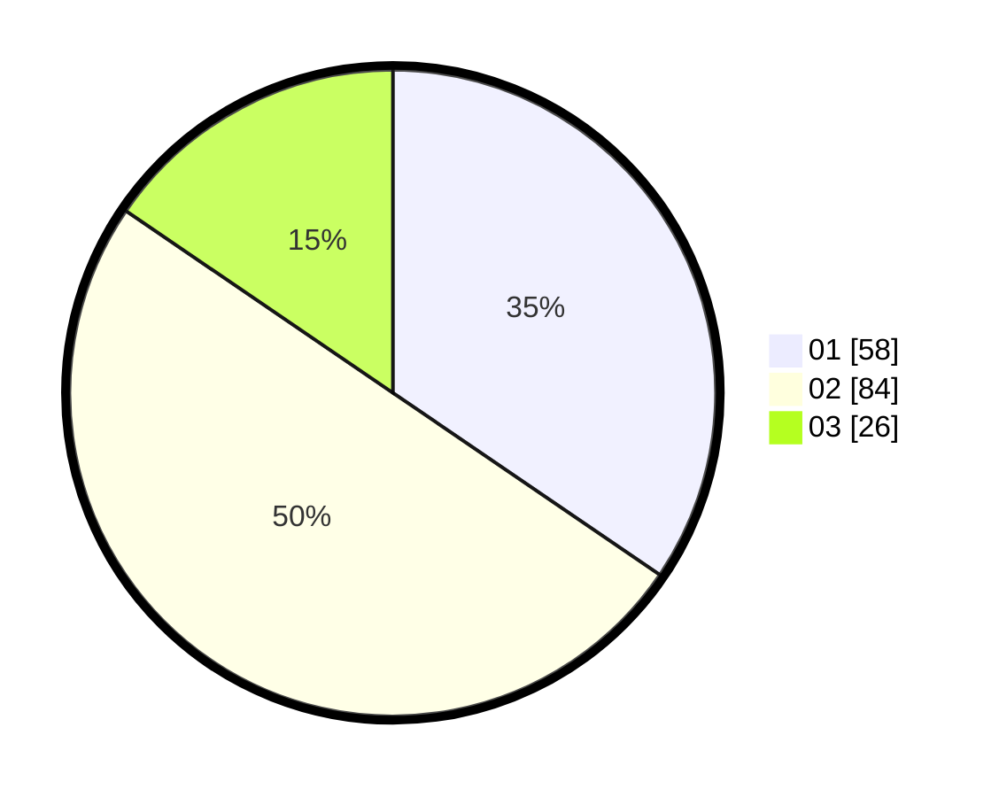

# Hasil

Hasil perolehan suara paslon dapat dilihat pada file paslon-01.txt, paslon-02.txt, dan paslon-03.txt.

Jika tidak ada, artinya data tersebut belum ada pada SIREKAP.

## Perolehan Suara

 * Paslon 01: **58**.
 * Paslon 02: **84**.
 * Paslon 03: **26**.

## Foto C Plano

https://sirekap-obj-formc.kpu.go.id/67f7/pemilu/ppwp/31/75/06/10/01/3175061001134-20240214-224617--f99ee69d-c74f-4e1f-9f5b-82cc7eeeb12b.jpg

https://sirekap-obj-formc.kpu.go.id/67f7/pemilu/ppwp/31/75/06/10/01/3175061001134-20240214-225320--13fb4093-5760-408c-8c76-379375ef6fbf.jpg

https://sirekap-obj-formc.kpu.go.id/67f7/pemilu/ppwp/31/75/06/10/01/3175061001134-20240214-225536--3d877a6d-ff60-45b5-bb3c-6ca3c436e69d.jpg
