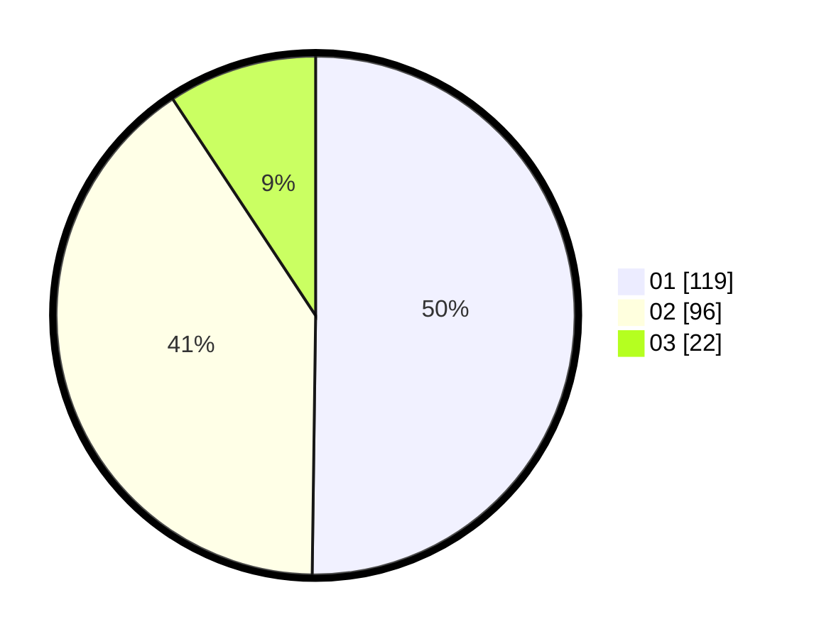

# Hasil

Hasil perolehan suara paslon dapat dilihat pada file paslon-01.txt, paslon-02.txt, dan paslon-03.txt.

Jika tidak ada, artinya data tersebut belum ada pada SIREKAP.

## Perolehan Suara

 * Paslon 01: **119**.
 * Paslon 02: **96**.
 * Paslon 03: **22**.

## Foto C Plano

https://sirekap-obj-formc.kpu.go.id/eb3d/pemilu/ppwp/31/75/06/10/01/3175061001144-20240214-203603--064229e2-b2fb-44e2-a178-5c1d5f88b0b2.jpg

https://sirekap-obj-formc.kpu.go.id/eb3d/pemilu/ppwp/31/75/06/10/01/3175061001144-20240214-203559--68d238a1-098a-46e6-bf0e-ed282b3a0b55.jpg

https://sirekap-obj-formc.kpu.go.id/eb3d/pemilu/ppwp/31/75/06/10/01/3175061001144-20240214-203331--45b21d42-fd37-4cac-a022-ed55b0468354.jpg

## DATA PEMILIH TETAP

Jumlah pemilih dalam DPT: **274**.
 * L: **144**.
 * P: **130**.

## DATA PENGGUNA HAK PILIH

Jumlah pengguna hak pilih dalam DPT: **227**.
 * L: **119**.
 * P: **108**.

Jumlah pengguna hak pilih dalam DPTb: **7**.
 * L: **2**.
 * P: **5**.

Jumlah pengguna hak pilih dalam DPK: **3**.
 * L: **0**.
 * P: **3**.

Jumlah pengguna hak pilih: **237**.
 * L: **121**.
 * P: **116**.

## JUMLAH SUARA SAH DAN TIDAK SAH

JUMLAH SELURUH SUARA SAH: **237**.

JUMLAH SUARA TIDAK SAH: **0**.

JUMLAH SELURUH SUARA SAH DAN SUARA TIDAK SAH: **237**.
