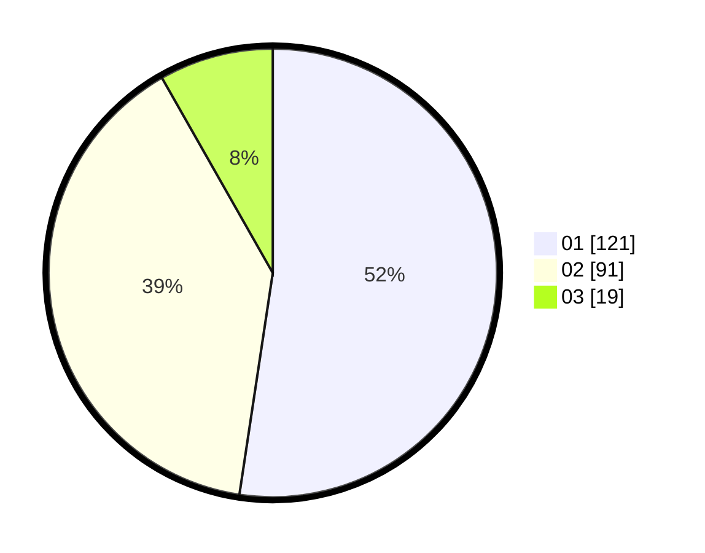

# Hasil

Hasil perolehan suara paslon dapat dilihat pada file paslon-01.txt, paslon-02.txt, dan paslon-03.txt.

Jika tidak ada, artinya data tersebut belum ada pada SIREKAP.

## Perolehan Suara

 * Paslon 01: **121**.
 * Paslon 02: **91**.
 * Paslon 03: **19**.

## Foto C Plano

https://sirekap-obj-formc.kpu.go.id/6f37/pemilu/ppwp/31/75/06/10/01/3175061001145-20240214-155012--a1e8a6bb-a7c6-46e5-8a05-61683f899e3a.jpg

https://sirekap-obj-formc.kpu.go.id/6f37/pemilu/ppwp/31/75/06/10/01/3175061001145-20240214-155750--7ac0ab71-9393-4ff7-aa78-ad4bab41f368.jpg

https://sirekap-obj-formc.kpu.go.id/6f37/pemilu/ppwp/31/75/06/10/01/3175061001145-20240214-155825--81de9b27-d4a9-49bf-a3a9-fd028cdf76db.jpg

## DATA PEMILIH TETAP

Jumlah pemilih dalam DPT: **277**.
 * L: **136**.
 * P: **141**.

## DATA PENGGUNA HAK PILIH

Jumlah pengguna hak pilih dalam DPT: **226**.
 * L: **104**.
 * P: **122**.

Jumlah pengguna hak pilih dalam DPTb: **6**.
 * L: **4**.
 * P: **2**.

Jumlah pengguna hak pilih dalam DPK: **0**.
 * L: **0**.
 * P: **0**.

Jumlah pengguna hak pilih: **232**.
 * L: **108**.
 * P: **124**.

## JUMLAH SUARA SAH DAN TIDAK SAH

JUMLAH SELURUH SUARA SAH: **231**.

JUMLAH SUARA TIDAK SAH: **1**.

JUMLAH SELURUH SUARA SAH DAN SUARA TIDAK SAH: **232**.
