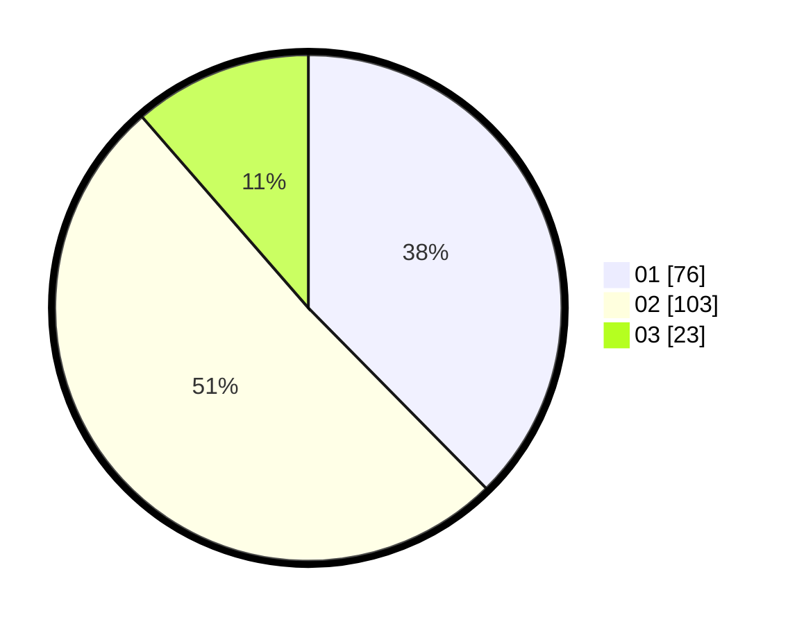

# Hasil

Hasil perolehan suara paslon dapat dilihat pada file paslon-01.txt, paslon-02.txt, dan paslon-03.txt.

Jika tidak ada, artinya data tersebut belum ada pada SIREKAP.

## Perolehan Suara

 * Paslon 01: **76**.
 * Paslon 02: **103**.
 * Paslon 03: **23**.

## Foto C Plano

https://sirekap-obj-formc.kpu.go.id/a350/pemilu/ppwp/31/75/06/10/01/3175061001147-20240214-190849--6fb81bcc-6ae0-4ba1-8556-6a54921db569.jpg

https://sirekap-obj-formc.kpu.go.id/a350/pemilu/ppwp/31/75/06/10/01/3175061001147-20240214-190901--da9b2b29-9d55-449b-acbf-374dd03ef80d.jpg

https://sirekap-obj-formc.kpu.go.id/a350/pemilu/ppwp/31/75/06/10/01/3175061001147-20240214-190904--63f2856f-ab66-48e0-a031-29afe952e83a.jpg

## DATA PEMILIH TETAP

Jumlah pemilih dalam DPT: **274**.
 * L: **127**.
 * P: **147**.

## DATA PENGGUNA HAK PILIH

Jumlah pengguna hak pilih dalam DPT: **200**.
 * L: **90**.
 * P: **110**.

Jumlah pengguna hak pilih dalam DPTb: **3**.
 * L: **1**.
 * P: **2**.

Jumlah pengguna hak pilih dalam DPK: **0**.
 * L: **0**.
 * P: **0**.

Jumlah pengguna hak pilih: **203**.
 * L: **91**.
 * P: **112**.

## JUMLAH SUARA SAH DAN TIDAK SAH

JUMLAH SELURUH SUARA SAH: **202**.

JUMLAH SUARA TIDAK SAH: **1**.

JUMLAH SELURUH SUARA SAH DAN SUARA TIDAK SAH: **203**.
