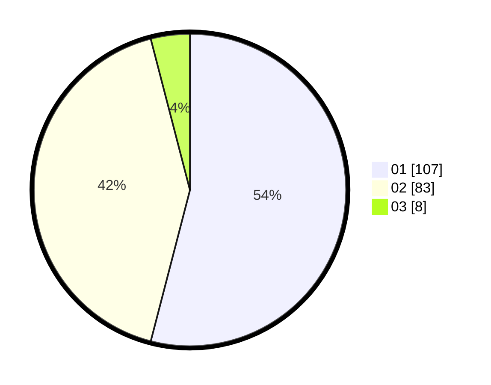

# Hasil

Hasil perolehan suara paslon dapat dilihat pada file paslon-01.txt, paslon-02.txt, dan paslon-03.txt.

Jika tidak ada, artinya data tersebut belum ada pada SIREKAP.

## Perolehan Suara

 * Paslon 01: **107**.
 * Paslon 02: **83**.
 * Paslon 03: **8**.

## Foto C Plano

https://sirekap-obj-formc.kpu.go.id/418f/pemilu/ppwp/31/75/06/10/01/3175061001148-20240214-204628--199117f4-88c3-40e2-bddd-d85ff767b78b.jpg

https://sirekap-obj-formc.kpu.go.id/418f/pemilu/ppwp/31/75/06/10/01/3175061001148-20240215-131750--82350bcb-750d-402d-8d8c-9351232e25f7.jpg

https://sirekap-obj-formc.kpu.go.id/418f/pemilu/ppwp/31/75/06/10/01/3175061001148-20240214-203947--d8cd000f-471b-4d72-bb5c-c8975d6c8648.jpg
