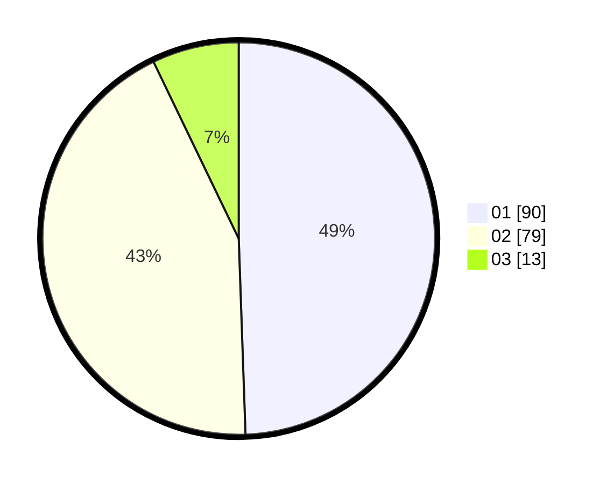

# Hasil

Hasil perolehan suara paslon dapat dilihat pada file paslon-01.txt, paslon-02.txt, dan paslon-03.txt.

Jika tidak ada, artinya data tersebut belum ada pada SIREKAP.

## Perolehan Suara

 * Paslon 01: **90**.
 * Paslon 02: **79**.
 * Paslon 03: **13**.

## Foto C Plano

https://sirekap-obj-formc.kpu.go.id/8048/pemilu/ppwp/31/75/06/10/01/3175061001153-20240215-000829--33f110fc-b410-49d1-bbe5-a617d2d01534.jpg

https://sirekap-obj-formc.kpu.go.id/8048/pemilu/ppwp/31/75/06/10/01/3175061001153-20240215-000950--fde8dad9-8806-4396-a647-7ce066b00c34.jpg

https://sirekap-obj-formc.kpu.go.id/8048/pemilu/ppwp/31/75/06/10/01/3175061001153-20240215-001622--79f34542-bfd2-495a-a518-433ec0ca8019.jpg

## DATA PEMILIH TETAP

Jumlah pemilih dalam DPT: **184**.
 * L: **86**.
 * P: **98**.

## DATA PENGGUNA HAK PILIH

Jumlah pengguna hak pilih dalam DPT: **246**.
 * L: **120**.
 * P: **126**.

Jumlah pengguna hak pilih dalam DPTb: **1**.
 * L: **1**.
 * P: **0**.

Jumlah pengguna hak pilih dalam DPK: **0**.
 * L: **0**.
 * P: **0**.

Jumlah pengguna hak pilih: **247**.
 * L: **121**.
 * P: **126**.

## JUMLAH SUARA SAH DAN TIDAK SAH

JUMLAH SELURUH SUARA SAH: **182**.

JUMLAH SUARA TIDAK SAH: **2**.

JUMLAH SELURUH SUARA SAH DAN SUARA TIDAK SAH: **184**.
