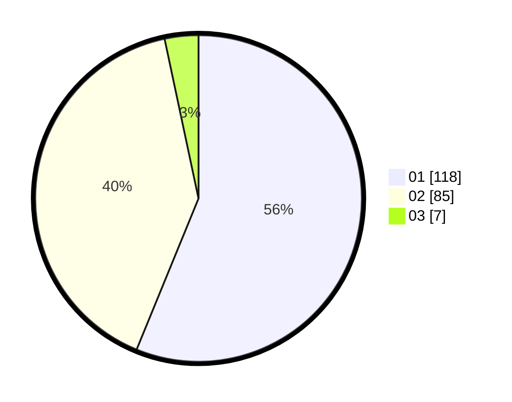

# Hasil

Hasil perolehan suara paslon dapat dilihat pada file paslon-01.txt, paslon-02.txt, dan paslon-03.txt.

Jika tidak ada, artinya data tersebut belum ada pada SIREKAP.

## Perolehan Suara

 * Paslon 01: **118**.
 * Paslon 02: **85**.
 * Paslon 03: **7**.

## Foto C Plano

https://sirekap-obj-formc.kpu.go.id/3d86/pemilu/ppwp/31/75/06/10/01/3175061001154-20240216-073648--23bc8e72-c0ea-46cf-be08-1c5a8752469a.jpg

https://sirekap-obj-formc.kpu.go.id/3d86/pemilu/ppwp/31/75/06/10/01/3175061001154-20240216-074450--02a1cfc0-873d-457a-bc2d-0a951e56ec67.jpg

https://sirekap-obj-formc.kpu.go.id/3d86/pemilu/ppwp/31/75/06/10/01/3175061001154-20240216-074748--921b8eb9-b461-4fa4-b7db-6f51632e707f.jpg

## DATA PEMILIH TETAP

Jumlah pemilih dalam DPT: **257**.
 * L: **119**.
 * P: **138**.

## DATA PENGGUNA HAK PILIH

Jumlah pengguna hak pilih dalam DPT: **205**.
 * L: **110**.
 * P: **95**.

Jumlah pengguna hak pilih dalam DPTb: **0**.
 * L: **0**.
 * P: **0**.

Jumlah pengguna hak pilih dalam DPK: **7**.
 * L: **4**.
 * P: **3**.

Jumlah pengguna hak pilih: **212**.
 * L: **114**.
 * P: **98**.

## JUMLAH SUARA SAH DAN TIDAK SAH

JUMLAH SELURUH SUARA SAH: **210**.

JUMLAH SUARA TIDAK SAH: **2**.

JUMLAH SELURUH SUARA SAH DAN SUARA TIDAK SAH: **212**.
