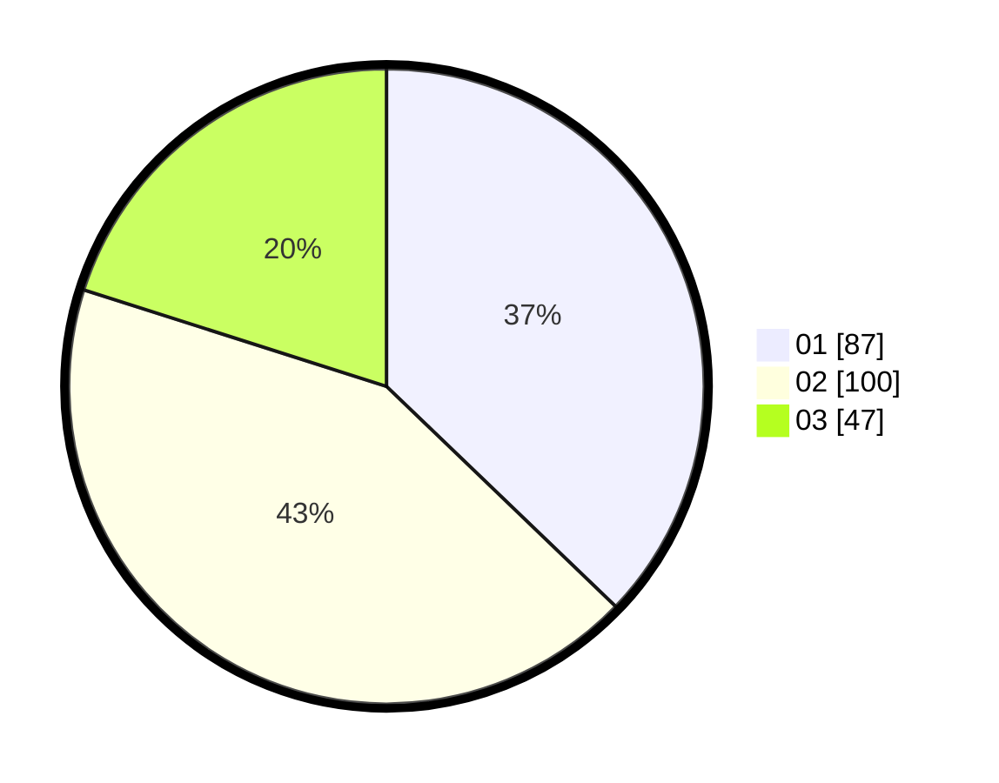

# Hasil

Hasil perolehan suara paslon dapat dilihat pada file paslon-01.txt, paslon-02.txt, dan paslon-03.txt.

Jika tidak ada, artinya data tersebut belum ada pada SIREKAP.

## Perolehan Suara

 * Paslon 01: **87**.
 * Paslon 02: **100**.
 * Paslon 03: **47**.

## Foto C Plano

https://sirekap-obj-formc.kpu.go.id/b1fb/pemilu/ppwp/31/75/06/10/01/3175061001162-20240215-033928--b2c36330-78ef-45dd-9049-9afb07dd7b54.jpg

https://sirekap-obj-formc.kpu.go.id/b1fb/pemilu/ppwp/31/75/06/10/01/3175061001162-20240215-040417--2c4a2dfc-74dc-4222-a03f-2dd21b86f730.jpg

https://sirekap-obj-formc.kpu.go.id/b1fb/pemilu/ppwp/31/75/06/10/01/3175061001162-20240215-034130--f59c0791-3666-44d3-9680-3cf32c95302c.jpg
