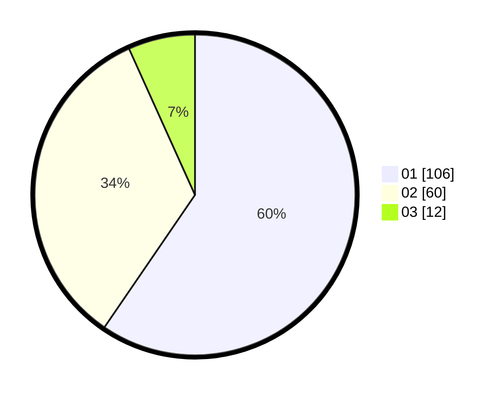

# Hasil

Hasil perolehan suara paslon dapat dilihat pada file paslon-01.txt, paslon-02.txt, dan paslon-03.txt.

Jika tidak ada, artinya data tersebut belum ada pada SIREKAP.

## Perolehan Suara

 * Paslon 01: **106**.
 * Paslon 02: **60**.
 * Paslon 03: **12**.

## Foto C Plano

https://sirekap-obj-formc.kpu.go.id/4e1f/pemilu/ppwp/31/75/06/10/01/3175061001168-20240215-004006--14a7e9e0-63b3-4c5e-bb8b-e623816db0a5.jpg

https://sirekap-obj-formc.kpu.go.id/4e1f/pemilu/ppwp/31/75/06/10/01/3175061001168-20240215-004009--9a7720fb-156e-4856-8b76-76ea2ecdfa5c.jpg

https://sirekap-obj-formc.kpu.go.id/4e1f/pemilu/ppwp/31/75/06/10/01/3175061001168-20240215-004013--adc85ff0-baef-4a5d-91c4-0c0d31169893.jpg

## DATA PEMILIH TETAP

Jumlah pemilih dalam DPT: **247**.
 * L: **128**.
 * P: **119**.

## DATA PENGGUNA HAK PILIH

Jumlah pengguna hak pilih dalam DPT: **179**.
 * L: **85**.
 * P: **94**.

Jumlah pengguna hak pilih dalam DPTb: **0**.
 * L: **0**.
 * P: **0**.

Jumlah pengguna hak pilih dalam DPK: **0**.
 * L: **0**.
 * P: **0**.

Jumlah pengguna hak pilih: **179**.
 * L: **85**.
 * P: **94**.

## JUMLAH SUARA SAH DAN TIDAK SAH

JUMLAH SELURUH SUARA SAH: **178**.

JUMLAH SUARA TIDAK SAH: **1**.

JUMLAH SELURUH SUARA SAH DAN SUARA TIDAK SAH: **179**.
