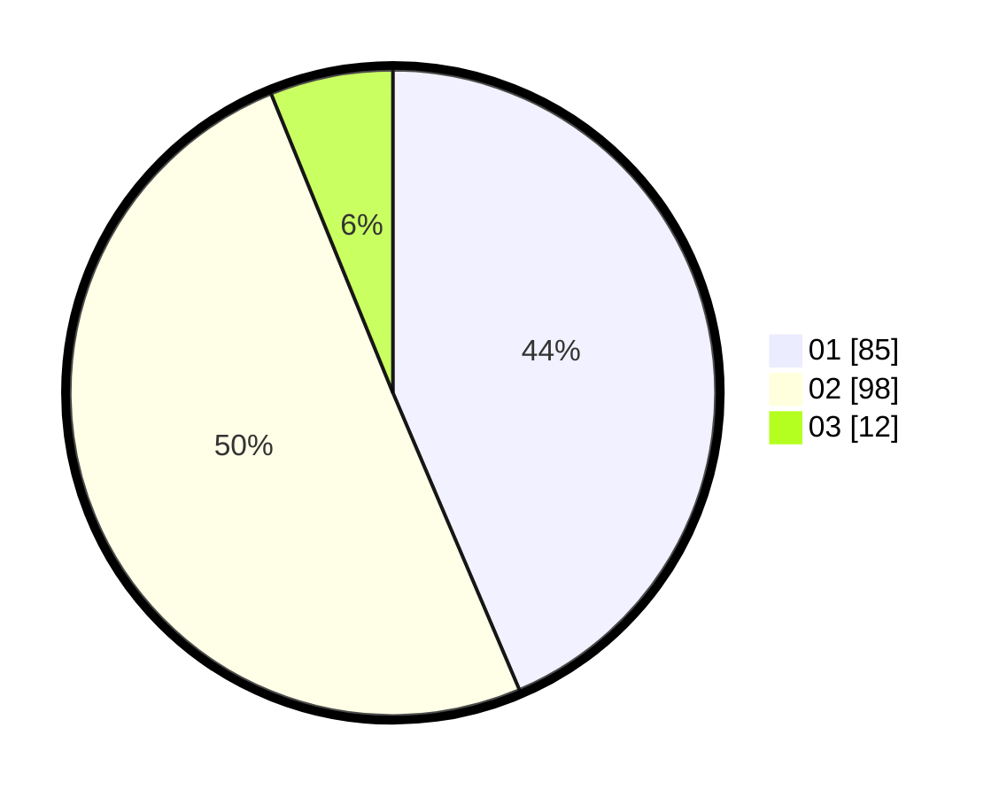

# Hasil

Hasil perolehan suara paslon dapat dilihat pada file paslon-01.txt, paslon-02.txt, dan paslon-03.txt.

Jika tidak ada, artinya data tersebut belum ada pada SIREKAP.

## Perolehan Suara

 * Paslon 01: **85**.
 * Paslon 02: **98**.
 * Paslon 03: **12**.

## Foto C Plano

https://sirekap-obj-formc.kpu.go.id/2548/pemilu/ppwp/31/75/06/10/01/3175061001171-20240215-013528--1ab07796-fe4e-4674-b982-d61b257d2869.jpg

https://sirekap-obj-formc.kpu.go.id/2548/pemilu/ppwp/31/75/06/10/01/3175061001171-20240215-004045--825f2e48-5a0f-409c-b7d0-24205e4bdcbf.jpg

https://sirekap-obj-formc.kpu.go.id/2548/pemilu/ppwp/31/75/06/10/01/3175061001171-20240215-004215--7017b5c2-9d4e-463f-adc6-300ddb2dc9e7.jpg
