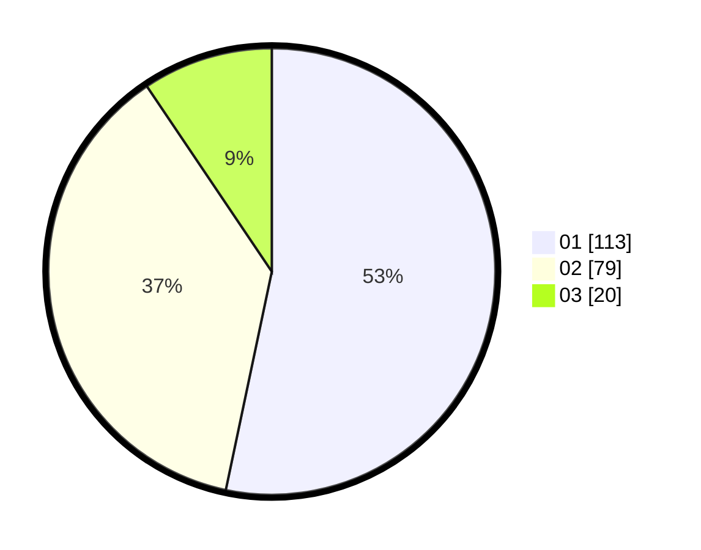

# Hasil

Hasil perolehan suara paslon dapat dilihat pada file paslon-01.txt, paslon-02.txt, dan paslon-03.txt.

Jika tidak ada, artinya data tersebut belum ada pada SIREKAP.

## Perolehan Suara

 * Paslon 01: **113**.
 * Paslon 02: **79**.
 * Paslon 03: **20**.

## Foto C Plano

https://sirekap-obj-formc.kpu.go.id/3b6e/pemilu/ppwp/31/75/06/10/01/3175061001175-20240214-193850--c2105c6b-9ed0-4003-85bc-56c62efbd7c7.jpg

https://sirekap-obj-formc.kpu.go.id/3b6e/pemilu/ppwp/31/75/06/10/01/3175061001175-20240214-192117--99fffc72-d916-4cd5-9540-9293f3737fc7.jpg

https://sirekap-obj-formc.kpu.go.id/3b6e/pemilu/ppwp/31/75/06/10/01/3175061001175-20240214-194053--ee774218-14ec-4a38-9f78-18bd44bd4de5.jpg

## DATA PEMILIH TETAP

Jumlah pemilih dalam DPT: **283**.
 * L: **149**.
 * P: **134**.

## DATA PENGGUNA HAK PILIH

Jumlah pengguna hak pilih dalam DPT: **211**.
 * L: **92**.
 * P: **119**.

Jumlah pengguna hak pilih dalam DPTb: **2**.
 * L: **1**.
 * P: **1**.

Jumlah pengguna hak pilih dalam DPK: **0**.
 * L: **0**.
 * P: **0**.

Jumlah pengguna hak pilih: **213**.
 * L: **93**.
 * P: **120**.

## JUMLAH SUARA SAH DAN TIDAK SAH

JUMLAH SELURUH SUARA SAH: **212**.

JUMLAH SUARA TIDAK SAH: **1**.

JUMLAH SELURUH SUARA SAH DAN SUARA TIDAK SAH: **213**.
