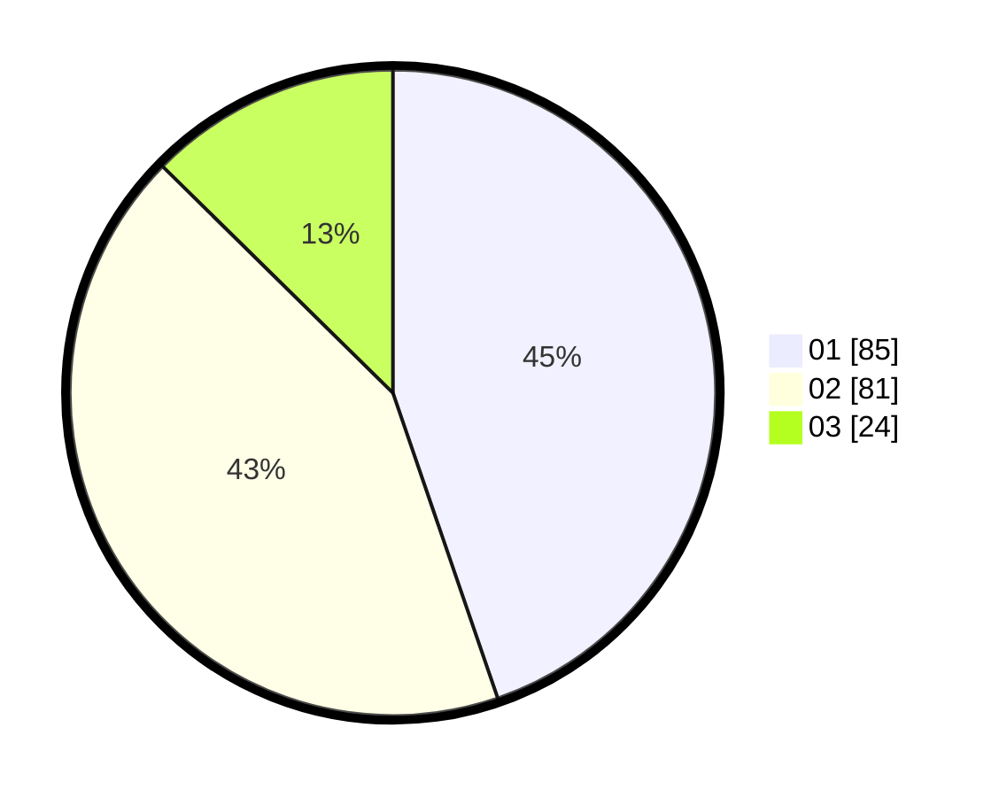

# Hasil

Hasil perolehan suara paslon dapat dilihat pada file paslon-01.txt, paslon-02.txt, dan paslon-03.txt.

Jika tidak ada, artinya data tersebut belum ada pada SIREKAP.

## Perolehan Suara

 * Paslon 01: **85**.
 * Paslon 02: **81**.
 * Paslon 03: **24**.

## Foto C Plano

https://sirekap-obj-formc.kpu.go.id/e799/pemilu/ppwp/31/75/06/10/01/3175061001177-20240214-214555--c6064218-cefa-4d73-a711-8a1c9eb12abe.jpg

https://sirekap-obj-formc.kpu.go.id/e799/pemilu/ppwp/31/75/06/10/01/3175061001177-20240214-214752--6eed0d81-64f8-4962-82a7-60e8f4654bc0.jpg

https://sirekap-obj-formc.kpu.go.id/e799/pemilu/ppwp/31/75/06/10/01/3175061001177-20240214-215009--f4c03c5e-a8cb-48ee-b4c6-6f9d382213ee.jpg
