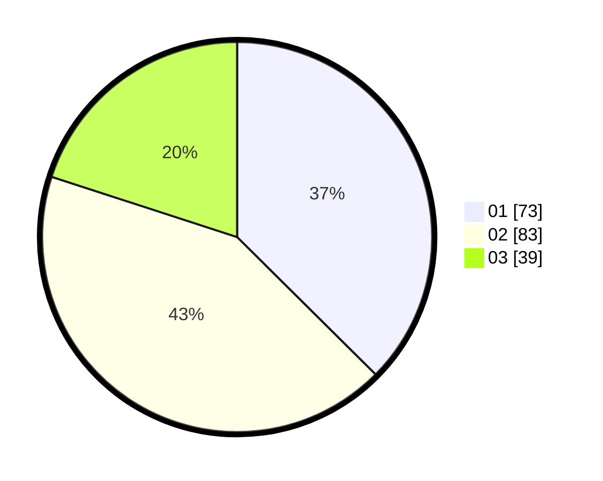

# Hasil

Hasil perolehan suara paslon dapat dilihat pada file paslon-01.txt, paslon-02.txt, dan paslon-03.txt.

Jika tidak ada, artinya data tersebut belum ada pada SIREKAP.

## Perolehan Suara

 * Paslon 01: **73**.
 * Paslon 02: **83**.
 * Paslon 03: **39**.

## Foto C Plano

https://sirekap-obj-formc.kpu.go.id/e04e/pemilu/ppwp/31/75/06/10/01/3175061001187-20240216-072410--375ca239-f5fb-432f-bf0c-ca2d75effafc.jpg

https://sirekap-obj-formc.kpu.go.id/e04e/pemilu/ppwp/31/75/06/10/01/3175061001187-20240216-072830--34c6abcd-dabc-4f42-ae99-20394407c820.jpg

https://sirekap-obj-formc.kpu.go.id/e04e/pemilu/ppwp/31/75/06/10/01/3175061001187-20240216-073054--6d162588-eac5-45af-bd9e-652c70c849aa.jpg

## DATA PEMILIH TETAP

Jumlah pemilih dalam DPT: **260**.
 * L: **139**.
 * P: **121**.

## DATA PENGGUNA HAK PILIH

Jumlah pengguna hak pilih dalam DPT: **198**.
 * L: **103**.
 * P: **95**.

Jumlah pengguna hak pilih dalam DPTb: **0**.
 * L: **0**.
 * P: **0**.

Jumlah pengguna hak pilih dalam DPK: **1**.
 * L: **0**.
 * P: **0**.

Jumlah pengguna hak pilih: **199**.
 * L: **103**.
 * P: **96**.

## JUMLAH SUARA SAH DAN TIDAK SAH

JUMLAH SELURUH SUARA SAH: **195**.

JUMLAH SUARA TIDAK SAH: **4**.

JUMLAH SELURUH SUARA SAH DAN SUARA TIDAK SAH: **199**.
