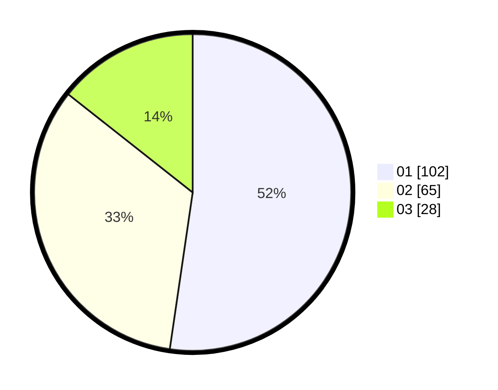

# Hasil

Hasil perolehan suara paslon dapat dilihat pada file paslon-01.txt, paslon-02.txt, dan paslon-03.txt.

Jika tidak ada, artinya data tersebut belum ada pada SIREKAP.

## Perolehan Suara

 * Paslon 01: **102**.
 * Paslon 02: **65**.
 * Paslon 03: **28**.

## Foto C Plano

https://sirekap-obj-formc.kpu.go.id/4041/pemilu/ppwp/31/75/06/10/01/3175061001193-20240214-205255--821a3efb-4701-4dd4-8a65-da7542c1ae8d.jpg

https://sirekap-obj-formc.kpu.go.id/4041/pemilu/ppwp/31/75/06/10/01/3175061001193-20240214-205118--f85ad9e8-d0e9-4bfe-a657-3e9f4c868397.jpg

https://sirekap-obj-formc.kpu.go.id/4041/pemilu/ppwp/31/75/06/10/01/3175061001193-20240214-205236--82053422-5372-4a1f-ba07-5606fc969813.jpg

## DATA PEMILIH TETAP

Jumlah pemilih dalam DPT: **252**.
 * L: **126**.
 * P: **126**.

## DATA PENGGUNA HAK PILIH

Jumlah pengguna hak pilih dalam DPT: **198**.
 * L: **93**.
 * P: **105**.

Jumlah pengguna hak pilih dalam DPTb: **0**.
 * L: **0**.
 * P: **0**.

Jumlah pengguna hak pilih dalam DPK: **0**.
 * L: **0**.
 * P: **0**.

Jumlah pengguna hak pilih: **198**.
 * L: **93**.
 * P: **105**.

## JUMLAH SUARA SAH DAN TIDAK SAH

JUMLAH SELURUH SUARA SAH: **195**.

JUMLAH SUARA TIDAK SAH: **3**.

JUMLAH SELURUH SUARA SAH DAN SUARA TIDAK SAH: **198**.
