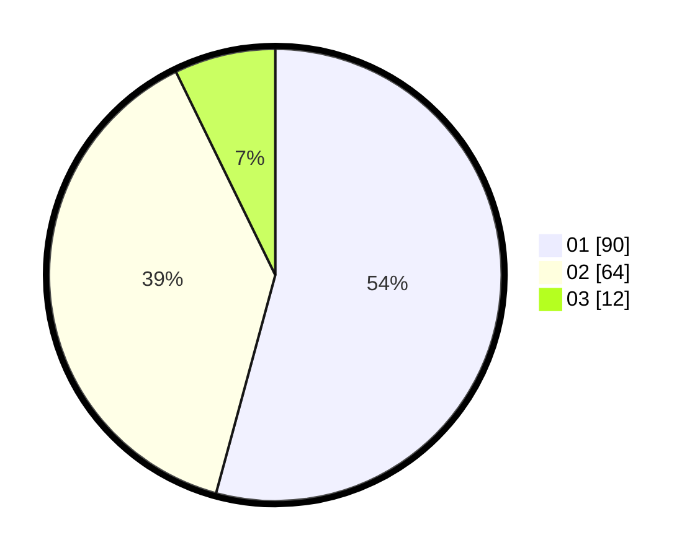

# Hasil

Hasil perolehan suara paslon dapat dilihat pada file paslon-01.txt, paslon-02.txt, dan paslon-03.txt.

Jika tidak ada, artinya data tersebut belum ada pada SIREKAP.

## Perolehan Suara

 * Paslon 01: **90**.
 * Paslon 02: **64**.
 * Paslon 03: **12**.

## Foto C Plano

https://sirekap-obj-formc.kpu.go.id/78e8/pemilu/ppwp/31/75/06/10/01/3175061001199-20240215-001107--defec409-f413-4258-85c9-db8925a6481e.jpg

https://sirekap-obj-formc.kpu.go.id/78e8/pemilu/ppwp/31/75/06/10/01/3175061001199-20240215-001308--aa5ee59f-35a1-4b53-a4a4-adbfa333e65d.jpg

https://sirekap-obj-formc.kpu.go.id/78e8/pemilu/ppwp/31/75/06/10/01/3175061001199-20240215-001457--0e117c18-e4a2-45e9-9fc2-cf5800c78762.jpg
