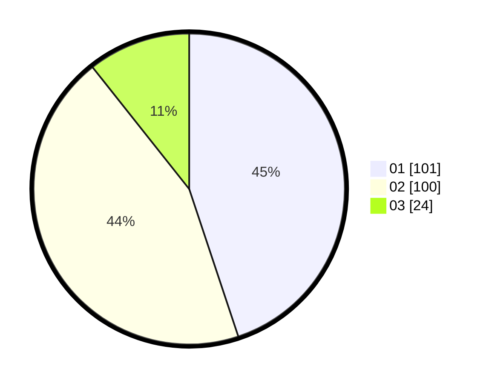

# Hasil

Hasil perolehan suara paslon dapat dilihat pada file paslon-01.txt, paslon-02.txt, dan paslon-03.txt.

Jika tidak ada, artinya data tersebut belum ada pada SIREKAP.

## Perolehan Suara

 * Paslon 01: **101**.
 * Paslon 02: **100**.
 * Paslon 03: **24**.

## Foto C Plano

https://sirekap-obj-formc.kpu.go.id/9fbd/pemilu/ppwp/31/75/06/10/01/3175061001208-20240214-212910--21e90853-586a-40ac-a2f2-ee0afc1ddfe3.jpg

https://sirekap-obj-formc.kpu.go.id/9fbd/pemilu/ppwp/31/75/06/10/01/3175061001208-20240214-212930--8ab8f136-33e6-4fd7-a5f5-0d859b292c0a.jpg

https://sirekap-obj-formc.kpu.go.id/9fbd/pemilu/ppwp/31/75/06/10/01/3175061001208-20240214-212951--cd47b97e-5456-4356-be6a-344c63e36dcb.jpg
