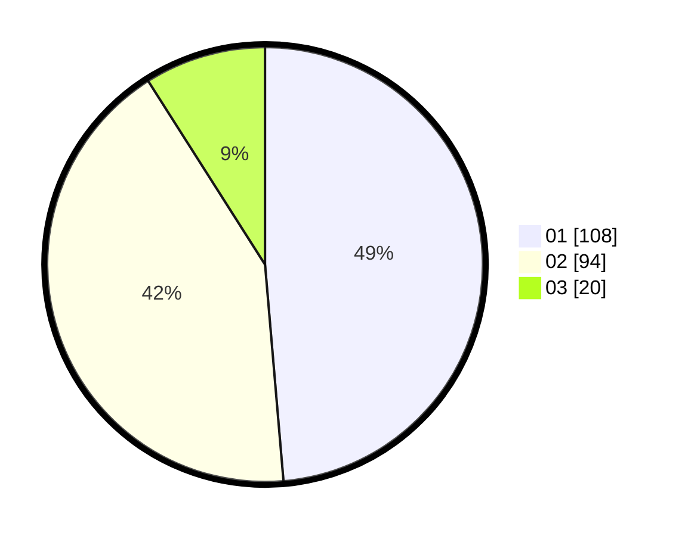

# Hasil

Hasil perolehan suara paslon dapat dilihat pada file paslon-01.txt, paslon-02.txt, dan paslon-03.txt.

Jika tidak ada, artinya data tersebut belum ada pada SIREKAP.

## Perolehan Suara

 * Paslon 01: **108**.
 * Paslon 02: **94**.
 * Paslon 03: **20**.

## Foto C Plano

https://sirekap-obj-formc.kpu.go.id/3ac8/pemilu/ppwp/31/75/06/10/01/3175061001219-20240214-201215--9a597e6a-8453-4c00-9028-565730b853cd.jpg

https://sirekap-obj-formc.kpu.go.id/3ac8/pemilu/ppwp/31/75/06/10/01/3175061001219-20240214-202755--427e3369-348e-4a4c-bebb-b97c782865a9.jpg

https://sirekap-obj-formc.kpu.go.id/3ac8/pemilu/ppwp/31/75/06/10/01/3175061001219-20240214-203046--83c5e5f1-90a0-422d-8e07-b664513930ee.jpg

## DATA PEMILIH TETAP

Jumlah pemilih dalam DPT: **270**.
 * L: **134**.
 * P: **136**.

## DATA PENGGUNA HAK PILIH

Jumlah pengguna hak pilih dalam DPT: **224**.
 * L: **106**.
 * P: **118**.

Jumlah pengguna hak pilih dalam DPTb: **0**.
 * L: **0**.
 * P: **0**.

Jumlah pengguna hak pilih dalam DPK: **0**.
 * L: **0**.
 * P: **0**.

Jumlah pengguna hak pilih: **224**.
 * L: **106**.
 * P: **118**.

## JUMLAH SUARA SAH DAN TIDAK SAH

JUMLAH SELURUH SUARA SAH: **222**.

JUMLAH SUARA TIDAK SAH: **2**.

JUMLAH SELURUH SUARA SAH DAN SUARA TIDAK SAH: **224**.
