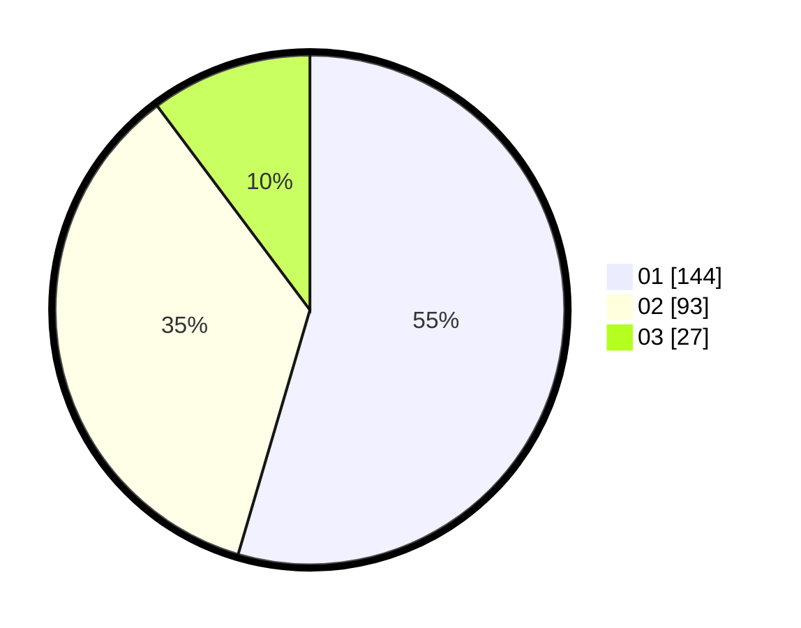

# Hasil

Hasil perolehan suara paslon dapat dilihat pada file paslon-01.txt, paslon-02.txt, dan paslon-03.txt.

Jika tidak ada, artinya data tersebut belum ada pada SIREKAP.

## Perolehan Suara

 * Paslon 01: **144**.
 * Paslon 02: **93**.
 * Paslon 03: **27**.

## Foto C Plano

https://sirekap-obj-formc.kpu.go.id/d34a/pemilu/ppwp/31/75/06/10/01/3175061001225-20240215-145627--45176577-5231-4719-a5a1-87ddabba6caf.jpg

https://sirekap-obj-formc.kpu.go.id/d34a/pemilu/ppwp/31/75/06/10/01/3175061001225-20240215-230723--094c6f59-e404-435a-baa1-3eacc7e158fd.jpg

https://sirekap-obj-formc.kpu.go.id/d34a/pemilu/ppwp/31/75/06/10/01/3175061001225-20240215-231843--290dfef5-fecd-4c69-9b7a-171f47ae0af0.jpg

## DATA PEMILIH TETAP

Jumlah pemilih dalam DPT: **283**.
 * L: **146**.
 * P: **137**.

## DATA PENGGUNA HAK PILIH

Jumlah pengguna hak pilih dalam DPT: **255**.
 * L: **128**.
 * P: **127**.

Jumlah pengguna hak pilih dalam DPTb: **8**.
 * L: **3**.
 * P: **5**.

Jumlah pengguna hak pilih dalam DPK: **4**.
 * L: **1**.
 * P: **3**.

Jumlah pengguna hak pilih: **267**.
 * L: **132**.
 * P: **135**.

## JUMLAH SUARA SAH DAN TIDAK SAH

JUMLAH SELURUH SUARA SAH: **264**.

JUMLAH SUARA TIDAK SAH: **3**.

JUMLAH SELURUH SUARA SAH DAN SUARA TIDAK SAH: **267**.
