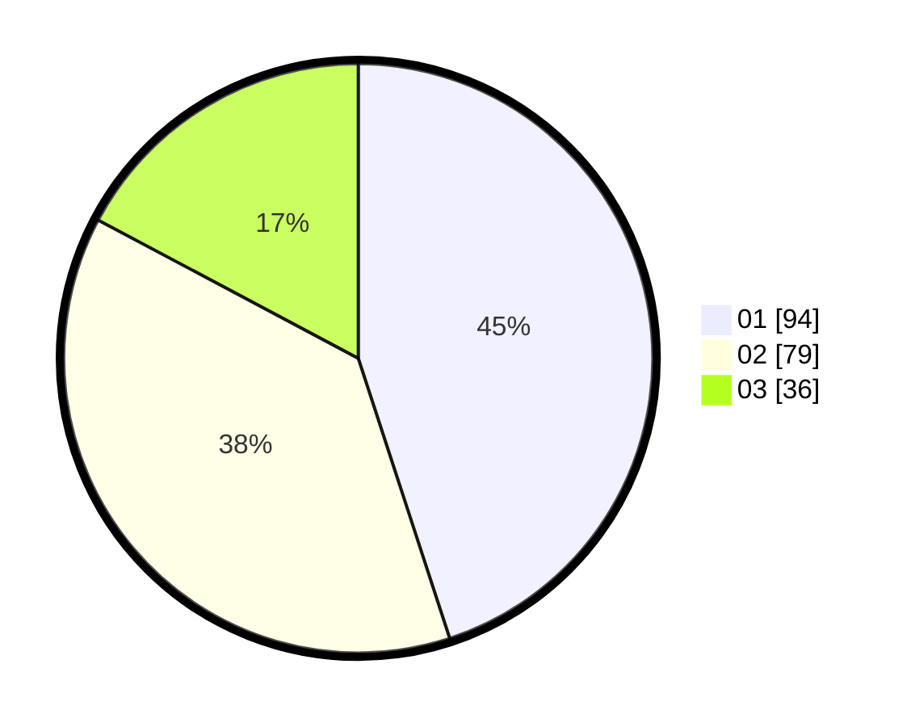

# Hasil

Hasil perolehan suara paslon dapat dilihat pada file paslon-01.txt, paslon-02.txt, dan paslon-03.txt.

Jika tidak ada, artinya data tersebut belum ada pada SIREKAP.

## Perolehan Suara

 * Paslon 01: **94**.
 * Paslon 02: **79**.
 * Paslon 03: **36**.

## Foto C Plano

https://sirekap-obj-formc.kpu.go.id/c716/pemilu/ppwp/31/75/06/10/01/3175061001227-20240215-225250--6c490ec1-2d49-4294-bf84-2d21055cc2c7.jpg

https://sirekap-obj-formc.kpu.go.id/c716/pemilu/ppwp/31/75/06/10/01/3175061001227-20240214-231741--e5dd8e2a-3ac1-4d43-a682-cc2eb372e549.jpg

https://sirekap-obj-formc.kpu.go.id/c716/pemilu/ppwp/31/75/06/10/01/3175061001227-20240214-231847--e2905298-14a6-4328-960c-4361dca4ffa2.jpg

## DATA PEMILIH TETAP

Jumlah pemilih dalam DPT: **204**.
 * L: **101**.
 * P: **103**.

## DATA PENGGUNA HAK PILIH

Jumlah pengguna hak pilih dalam DPT: **204**.
 * L: **101**.
 * P: **103**.

Jumlah pengguna hak pilih dalam DPTb: **4**.
 * L: **2**.
 * P: **2**.

Jumlah pengguna hak pilih dalam DPK: **2**.
 * L: **2**.
 * P: **0**.

Jumlah pengguna hak pilih: **210**.
 * L: **105**.
 * P: **105**.

## JUMLAH SUARA SAH DAN TIDAK SAH

JUMLAH SELURUH SUARA SAH: **209**.

JUMLAH SUARA TIDAK SAH: **1**.

JUMLAH SELURUH SUARA SAH DAN SUARA TIDAK SAH: **210**.
