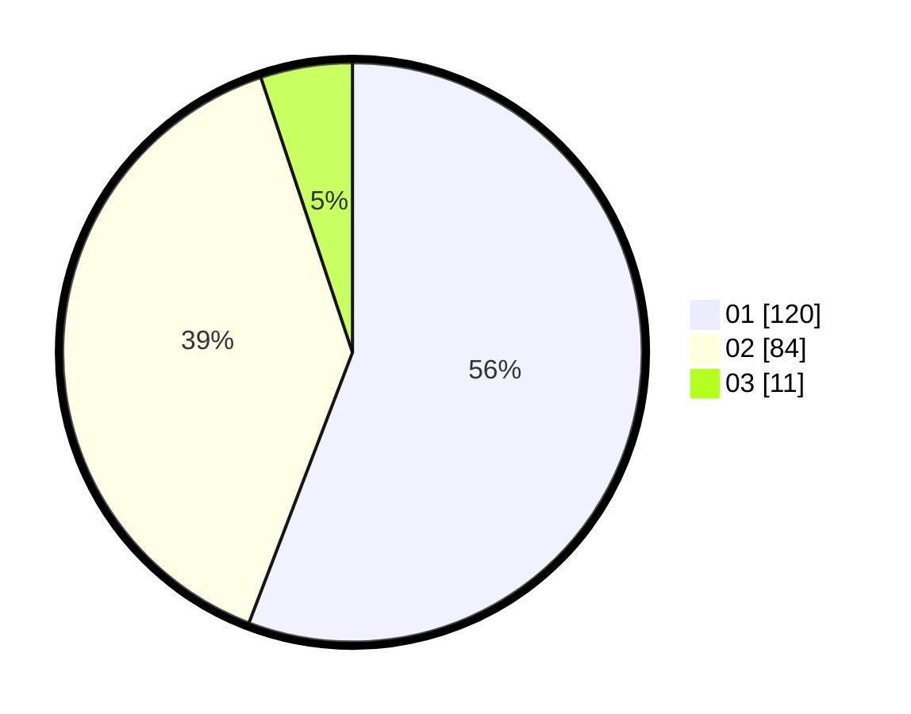

# Hasil

Hasil perolehan suara paslon dapat dilihat pada file paslon-01.txt, paslon-02.txt, dan paslon-03.txt.

Jika tidak ada, artinya data tersebut belum ada pada SIREKAP.

## Perolehan Suara

 * Paslon 01: **120**.
 * Paslon 02: **84**.
 * Paslon 03: **11**.

## Foto C Plano

https://sirekap-obj-formc.kpu.go.id/a087/pemilu/ppwp/31/75/06/10/01/3175061001230-20240214-214236--d9172b5d-6f42-4592-be16-9d0a538dcc48.jpg

https://sirekap-obj-formc.kpu.go.id/a087/pemilu/ppwp/31/75/06/10/01/3175061001230-20240214-214420--d29c8138-1380-4906-80cc-a4f50c726ddd.jpg

https://sirekap-obj-formc.kpu.go.id/a087/pemilu/ppwp/31/75/06/10/01/3175061001230-20240214-214540--903bbc90-8194-4c23-8603-c4bb9580c575.jpg

## DATA PEMILIH TETAP

Jumlah pemilih dalam DPT: **273**.
 * L: **141**.
 * P: **132**.

## DATA PENGGUNA HAK PILIH

Jumlah pengguna hak pilih dalam DPT: **212**.
 * L: **105**.
 * P: **107**.

Jumlah pengguna hak pilih dalam DPTb: **0**.
 * L: **0**.
 * P: **0**.

Jumlah pengguna hak pilih dalam DPK: **7**.
 * L: **3**.
 * P: **4**.

Jumlah pengguna hak pilih: **219**.
 * L: **108**.
 * P: **111**.

## JUMLAH SUARA SAH DAN TIDAK SAH

JUMLAH SELURUH SUARA SAH: **215**.

JUMLAH SUARA TIDAK SAH: **4**.

JUMLAH SELURUH SUARA SAH DAN SUARA TIDAK SAH: **219**.
