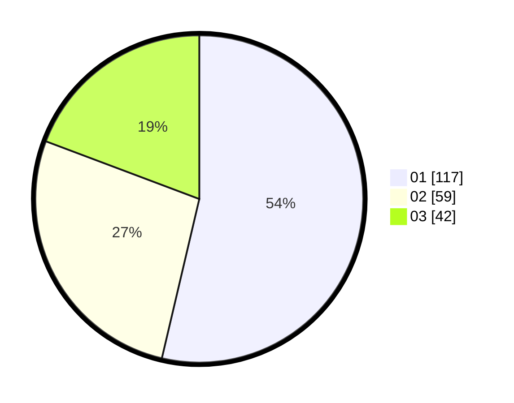

# Hasil

Hasil perolehan suara paslon dapat dilihat pada file paslon-01.txt, paslon-02.txt, dan paslon-03.txt.

Jika tidak ada, artinya data tersebut belum ada pada SIREKAP.

## Perolehan Suara

 * Paslon 01: **117**.
 * Paslon 02: **59**.
 * Paslon 03: **42**.

## Foto C Plano

https://sirekap-obj-formc.kpu.go.id/400f/pemilu/ppwp/31/75/06/10/01/3175061001231-20240214-222153--4fda0d4d-4094-413e-8629-0511f5fcf6df.jpg

https://sirekap-obj-formc.kpu.go.id/400f/pemilu/ppwp/31/75/06/10/01/3175061001231-20240214-222258--d8ca8a93-4257-4c34-a8f3-c6eccb400d46.jpg

https://sirekap-obj-formc.kpu.go.id/400f/pemilu/ppwp/31/75/06/10/01/3175061001231-20240215-222228--266abb9b-955e-4e7d-986d-2916ba5bff40.jpg

## DATA PEMILIH TETAP

Jumlah pemilih dalam DPT: **261**.
 * L: **128**.
 * P: **133**.

## DATA PENGGUNA HAK PILIH

Jumlah pengguna hak pilih dalam DPT: **213**.
 * L: **101**.
 * P: **112**.

Jumlah pengguna hak pilih dalam DPTb: **0**.
 * L: **0**.
 * P: **0**.

Jumlah pengguna hak pilih dalam DPK: **6**.
 * L: **4**.
 * P: **2**.

Jumlah pengguna hak pilih: **219**.
 * L: **105**.
 * P: **114**.

## JUMLAH SUARA SAH DAN TIDAK SAH

JUMLAH SELURUH SUARA SAH: **218**.

JUMLAH SUARA TIDAK SAH: **1**.

JUMLAH SELURUH SUARA SAH DAN SUARA TIDAK SAH: **219**.
