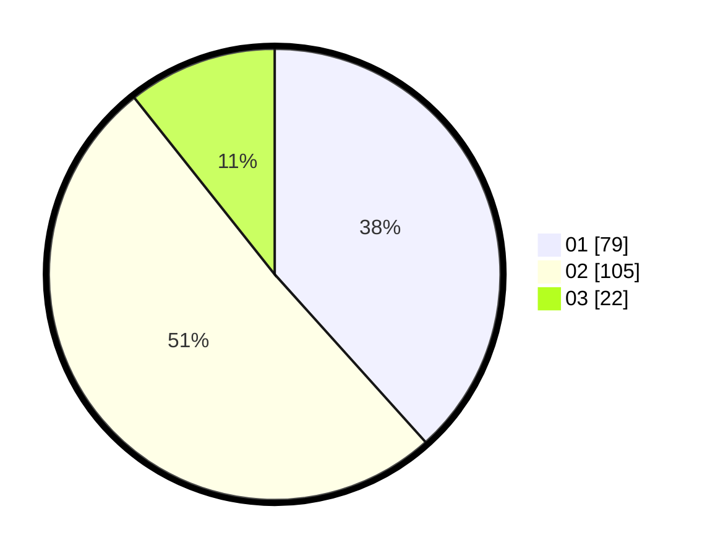

# Hasil

Hasil perolehan suara paslon dapat dilihat pada file paslon-01.txt, paslon-02.txt, dan paslon-03.txt.

Jika tidak ada, artinya data tersebut belum ada pada SIREKAP.

## Perolehan Suara

 * Paslon 01: **79**.
 * Paslon 02: **105**.
 * Paslon 03: **22**.

## Foto C Plano

https://sirekap-obj-formc.kpu.go.id/4897/pemilu/ppwp/31/75/06/10/01/3175061001234-20240214-193638--a9ea15a9-a7ea-4d10-a11a-dc2ad3e202e0.jpg

https://sirekap-obj-formc.kpu.go.id/4897/pemilu/ppwp/31/75/06/10/01/3175061001234-20240214-193756--a6c483c9-7432-4b64-aefb-77b3a9e0f088.jpg

https://sirekap-obj-formc.kpu.go.id/4897/pemilu/ppwp/31/75/06/10/01/3175061001234-20240214-193924--a8320c19-4a9d-4c24-b6cf-6ad8caf35b39.jpg

## DATA PEMILIH TETAP

Jumlah pemilih dalam DPT: **266**.
 * L: **138**.
 * P: **128**.

## DATA PENGGUNA HAK PILIH

Jumlah pengguna hak pilih dalam DPT: **204**.
 * L: **100**.
 * P: **104**.

Jumlah pengguna hak pilih dalam DPTb: **0**.
 * L: **0**.
 * P: **0**.

Jumlah pengguna hak pilih dalam DPK: **4**.
 * L: **2**.
 * P: **2**.

Jumlah pengguna hak pilih: **208**.
 * L: **102**.
 * P: **106**.

## JUMLAH SUARA SAH DAN TIDAK SAH

JUMLAH SELURUH SUARA SAH: **206**.

JUMLAH SUARA TIDAK SAH: **2**.

JUMLAH SELURUH SUARA SAH DAN SUARA TIDAK SAH: **208**.
