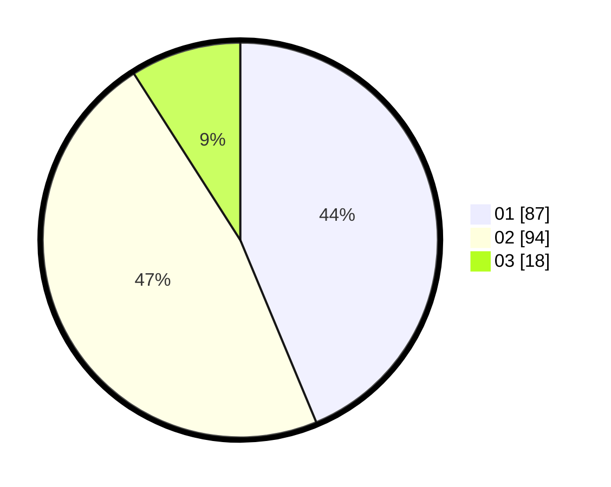

# Hasil

Hasil perolehan suara paslon dapat dilihat pada file paslon-01.txt, paslon-02.txt, dan paslon-03.txt.

Jika tidak ada, artinya data tersebut belum ada pada SIREKAP.

## Perolehan Suara

 * Paslon 01: **87**.
 * Paslon 02: **94**.
 * Paslon 03: **18**.

## Foto C Plano

https://sirekap-obj-formc.kpu.go.id/f898/pemilu/ppwp/31/75/06/10/01/3175061001235-20240215-001602--e4228667-8372-45d9-b5ca-39b9899ed0c8.jpg

https://sirekap-obj-formc.kpu.go.id/f898/pemilu/ppwp/31/75/06/10/01/3175061001235-20240215-001738--a0ba3e3d-1be4-4333-bb73-1dd4dde7f441.jpg

https://sirekap-obj-formc.kpu.go.id/f898/pemilu/ppwp/31/75/06/10/01/3175061001235-20240215-001809--b153a374-f907-4de2-9367-5e9a2b56b5c0.jpg
