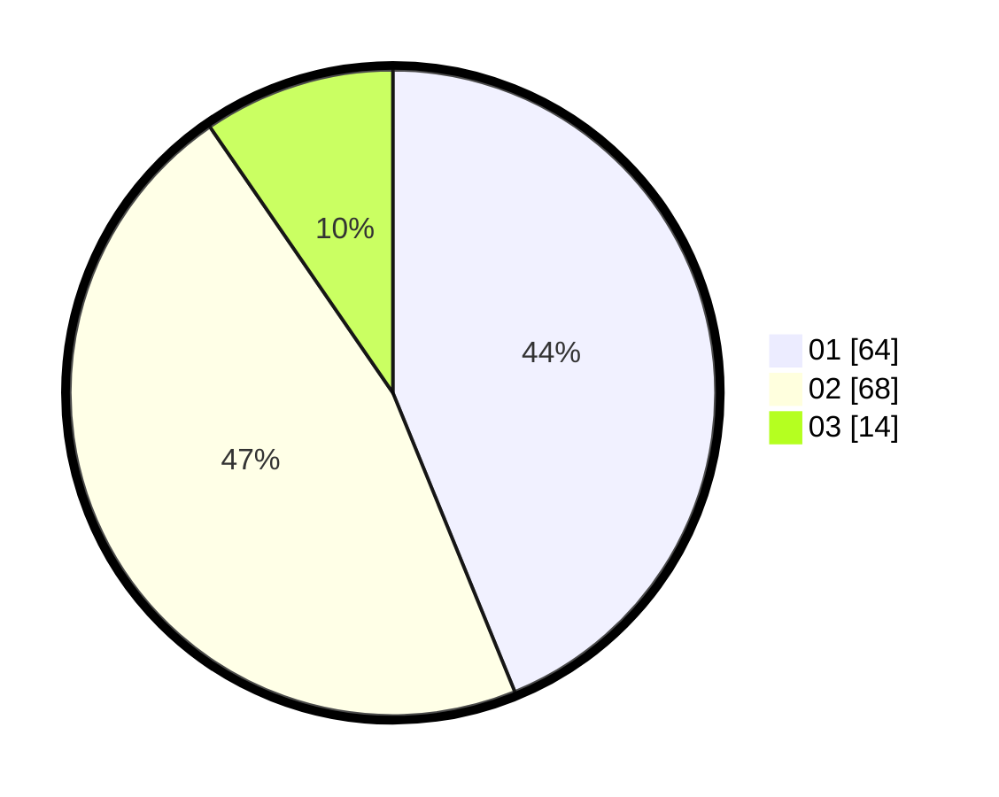

# Hasil

Hasil perolehan suara paslon dapat dilihat pada file paslon-01.txt, paslon-02.txt, dan paslon-03.txt.

Jika tidak ada, artinya data tersebut belum ada pada SIREKAP.

## Perolehan Suara

 * Paslon 01: **64**.
 * Paslon 02: **68**.
 * Paslon 03: **14**.

## Foto C Plano

https://sirekap-obj-formc.kpu.go.id/6b90/pemilu/ppwp/31/75/06/10/01/3175061001245-20240215-234441--50c06d89-96a8-4147-bc46-f3d70ecb94a3.jpg

https://sirekap-obj-formc.kpu.go.id/6b90/pemilu/ppwp/31/75/06/10/01/3175061001245-20240215-234444--f7f1459b-d8ef-4b69-8a60-c8ace5e0c726.jpg

https://sirekap-obj-formc.kpu.go.id/6b90/pemilu/ppwp/31/75/06/10/01/3175061001245-20240215-234446--d29ac7e8-ffb8-41b5-b97a-00e3e03fcb0a.jpg

## DATA PEMILIH TETAP

Jumlah pemilih dalam DPT: **148**.
 * L: **62**.
 * P: **86**.

## DATA PENGGUNA HAK PILIH

Jumlah pengguna hak pilih dalam DPT: **145**.
 * L: **61**.
 * P: **84**.

Jumlah pengguna hak pilih dalam DPTb: **3**.
 * L: **1**.
 * P: **2**.

Jumlah pengguna hak pilih dalam DPK: **0**.
 * L: **0**.
 * P: **0**.

Jumlah pengguna hak pilih: **148**.
 * L: **62**.
 * P: **86**.

## JUMLAH SUARA SAH DAN TIDAK SAH

JUMLAH SELURUH SUARA SAH: **146**.

JUMLAH SUARA TIDAK SAH: **2**.

JUMLAH SELURUH SUARA SAH DAN SUARA TIDAK SAH: **148**.
