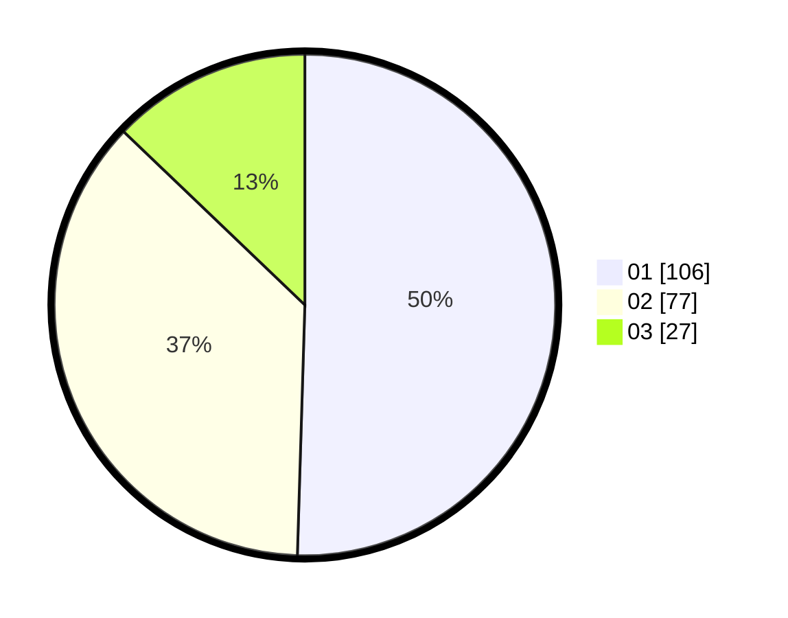

# Hasil

Hasil perolehan suara paslon dapat dilihat pada file paslon-01.txt, paslon-02.txt, dan paslon-03.txt.

Jika tidak ada, artinya data tersebut belum ada pada SIREKAP.

## Perolehan Suara

 * Paslon 01: **106**.
 * Paslon 02: **77**.
 * Paslon 03: **27**.

## Foto C Plano

https://sirekap-obj-formc.kpu.go.id/b49c/pemilu/ppwp/31/75/06/10/01/3175061001246-20240214-221940--da1695f1-a4bf-4848-bf2d-d32fd3d3f036.jpg

https://sirekap-obj-formc.kpu.go.id/b49c/pemilu/ppwp/31/75/06/10/01/3175061001246-20240214-222333--f81a9f76-436b-44a9-bcaa-87bfb993ecda.jpg

https://sirekap-obj-formc.kpu.go.id/b49c/pemilu/ppwp/31/75/06/10/01/3175061001246-20240214-222542--b65f5352-d9d0-4d81-b99c-0b2ab80ca7cb.jpg
