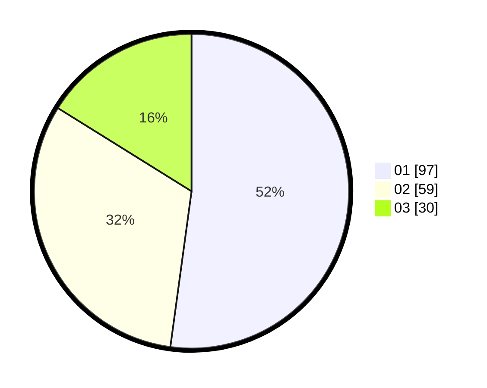

# Hasil

Hasil perolehan suara paslon dapat dilihat pada file paslon-01.txt, paslon-02.txt, dan paslon-03.txt.

Jika tidak ada, artinya data tersebut belum ada pada SIREKAP.

## Perolehan Suara

 * Paslon 01: **97**.
 * Paslon 02: **59**.
 * Paslon 03: **30**.

## Foto C Plano

https://sirekap-obj-formc.kpu.go.id/cd87/pemilu/ppwp/31/75/06/10/01/3175061001247-20240214-190941--ccd4b620-62f2-4676-8223-8965bc482a76.jpg

https://sirekap-obj-formc.kpu.go.id/cd87/pemilu/ppwp/31/75/06/10/01/3175061001247-20240214-191508--d8f46379-e020-4cff-8f21-075646954f66.jpg

https://sirekap-obj-formc.kpu.go.id/cd87/pemilu/ppwp/31/75/06/10/01/3175061001247-20240214-191052--570c09ad-03d5-4e88-8031-685195d57535.jpg

## DATA PEMILIH TETAP

Jumlah pemilih dalam DPT: **260**.
 * L: **128**.
 * P: **132**.

## DATA PENGGUNA HAK PILIH

Jumlah pengguna hak pilih dalam DPT: **188**.
 * L: **87**.
 * P: **101**.

Jumlah pengguna hak pilih dalam DPTb: **0**.
 * L: **0**.
 * P: **0**.

Jumlah pengguna hak pilih dalam DPK: **0**.
 * L: **0**.
 * P: **0**.

Jumlah pengguna hak pilih: **188**.
 * L: **87**.
 * P: **101**.

## JUMLAH SUARA SAH DAN TIDAK SAH

JUMLAH SELURUH SUARA SAH: **186**.

JUMLAH SUARA TIDAK SAH: **2**.

JUMLAH SELURUH SUARA SAH DAN SUARA TIDAK SAH: **188**.
