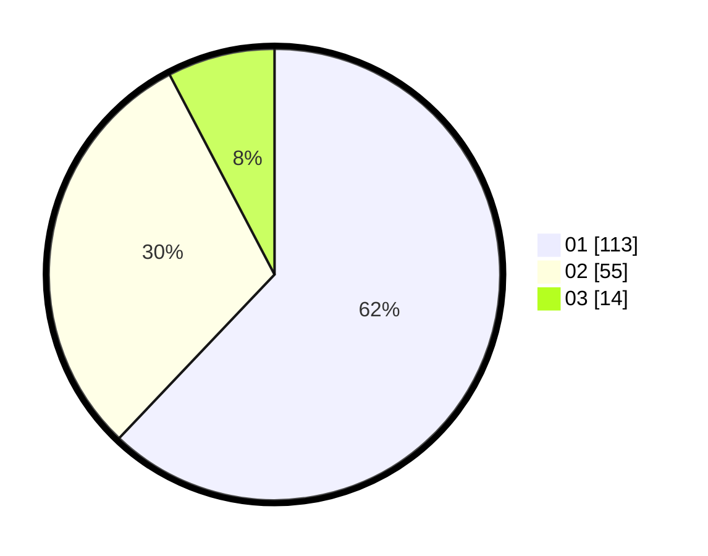

# Hasil

Hasil perolehan suara paslon dapat dilihat pada file paslon-01.txt, paslon-02.txt, dan paslon-03.txt.

Jika tidak ada, artinya data tersebut belum ada pada SIREKAP.

## Perolehan Suara

 * Paslon 01: **113**.
 * Paslon 02: **55**.
 * Paslon 03: **14**.

## Foto C Plano

https://sirekap-obj-formc.kpu.go.id/e0f1/pemilu/ppwp/31/75/06/10/01/3175061001248-20240214-224811--87bd8dd2-fec3-4f50-9115-82e066b581a5.jpg

https://sirekap-obj-formc.kpu.go.id/e0f1/pemilu/ppwp/31/75/06/10/01/3175061001248-20240214-224917--077ce2da-3a7d-42c5-8906-ca894384cc18.jpg

https://sirekap-obj-formc.kpu.go.id/e0f1/pemilu/ppwp/31/75/06/10/01/3175061001248-20240214-225020--448a8743-8a76-453b-aad5-3959b091bb04.jpg

## DATA PEMILIH TETAP

Jumlah pemilih dalam DPT: **240**.
 * L: **120**.
 * P: **120**.

## DATA PENGGUNA HAK PILIH

Jumlah pengguna hak pilih dalam DPT: **181**.
 * L: **88**.
 * P: **93**.

Jumlah pengguna hak pilih dalam DPTb: **1**.
 * L: **1**.
 * P: **0**.

Jumlah pengguna hak pilih dalam DPK: **1**.
 * L: **0**.
 * P: **1**.

Jumlah pengguna hak pilih: **183**.
 * L: **89**.
 * P: **94**.

## JUMLAH SUARA SAH DAN TIDAK SAH

JUMLAH SELURUH SUARA SAH: **182**.

JUMLAH SUARA TIDAK SAH: **2**.

JUMLAH SELURUH SUARA SAH DAN SUARA TIDAK SAH: **184**.
