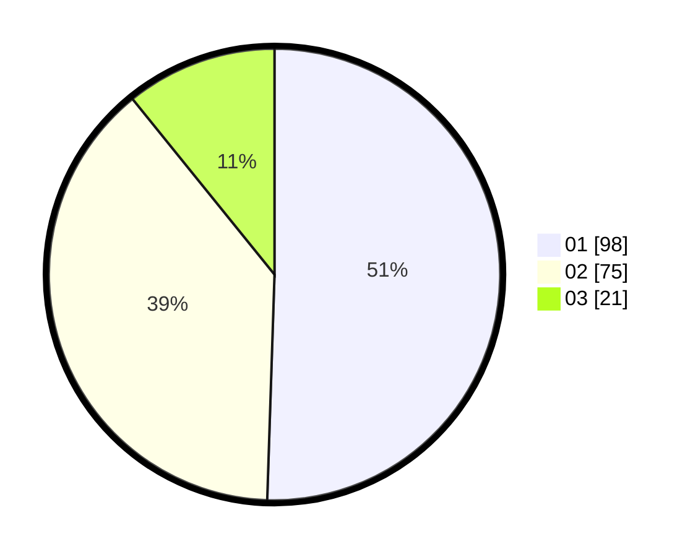

# Hasil

Hasil perolehan suara paslon dapat dilihat pada file paslon-01.txt, paslon-02.txt, dan paslon-03.txt.

Jika tidak ada, artinya data tersebut belum ada pada SIREKAP.

## Perolehan Suara

 * Paslon 01: **98**.
 * Paslon 02: **75**.
 * Paslon 03: **21**.

## Foto C Plano

https://sirekap-obj-formc.kpu.go.id/647c/pemilu/ppwp/31/75/06/10/01/3175061001250-20240214-194630--08ecc760-657a-4009-b5dd-1564512bd234.jpg

https://sirekap-obj-formc.kpu.go.id/647c/pemilu/ppwp/31/75/06/10/01/3175061001250-20240214-194355--c63ce28b-de75-4161-9f79-1bbad8db4683.jpg

https://sirekap-obj-formc.kpu.go.id/647c/pemilu/ppwp/31/75/06/10/01/3175061001250-20240214-194444--5f7c7d7d-94bf-40b5-b118-b43a3388fa6d.jpg
