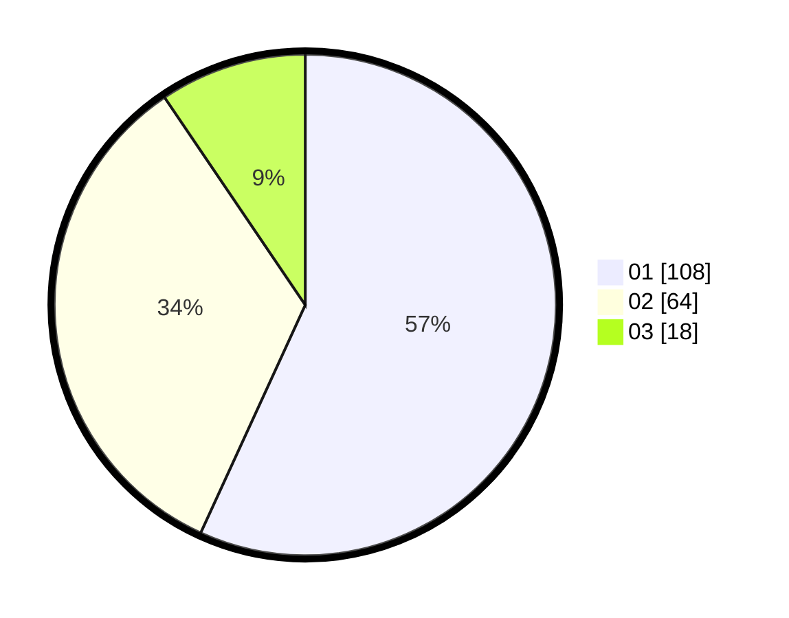

# Hasil

Hasil perolehan suara paslon dapat dilihat pada file paslon-01.txt, paslon-02.txt, dan paslon-03.txt.

Jika tidak ada, artinya data tersebut belum ada pada SIREKAP.

## Perolehan Suara

 * Paslon 01: **108**.
 * Paslon 02: **64**.
 * Paslon 03: **18**.

## Foto C Plano

https://sirekap-obj-formc.kpu.go.id/40c2/pemilu/ppwp/31/75/06/10/01/3175061001265-20240215-001026--d9baede0-0a9b-48e8-ae09-70eddab9f124.jpg

https://sirekap-obj-formc.kpu.go.id/40c2/pemilu/ppwp/31/75/06/10/01/3175061001265-20240215-001559--976f4b0b-1c29-4046-b34f-44e8922b6523.jpg

https://sirekap-obj-formc.kpu.go.id/40c2/pemilu/ppwp/31/75/06/10/01/3175061001265-20240215-001751--cd9f6aac-a5e8-4a64-81e5-37a61c77275d.jpg
