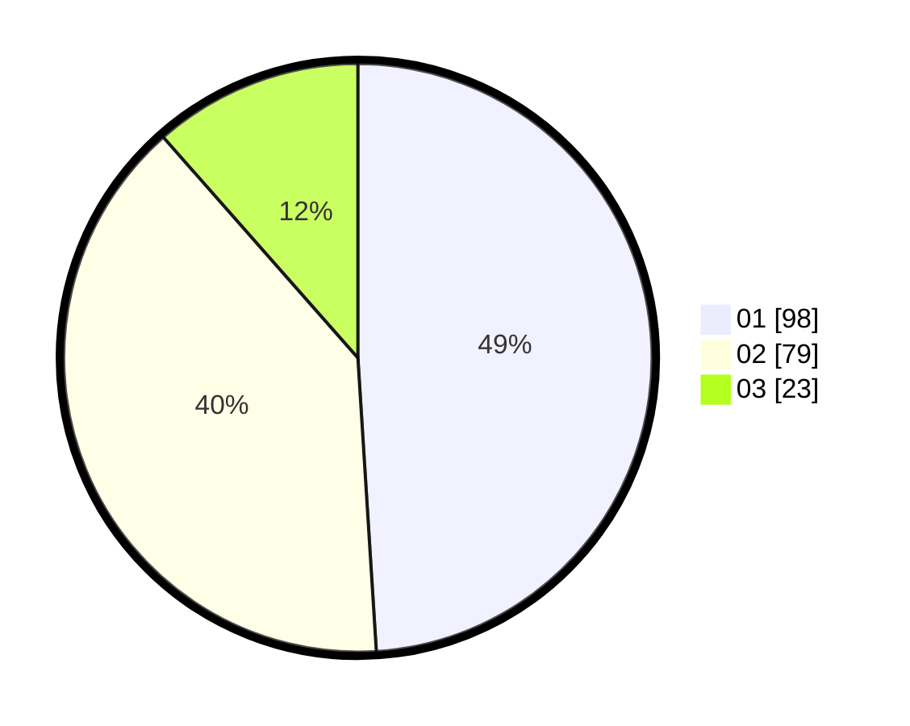

# Hasil

Hasil perolehan suara paslon dapat dilihat pada file paslon-01.txt, paslon-02.txt, dan paslon-03.txt.

Jika tidak ada, artinya data tersebut belum ada pada SIREKAP.

## Perolehan Suara

 * Paslon 01: **98**.
 * Paslon 02: **79**.
 * Paslon 03: **23**.

## Foto C Plano

https://sirekap-obj-formc.kpu.go.id/b1b2/pemilu/ppwp/31/75/06/10/01/3175061001272-20240214-155813--4867d8ee-b248-4170-8032-818e4bb9b4d6.jpg

https://sirekap-obj-formc.kpu.go.id/b1b2/pemilu/ppwp/31/75/06/10/01/3175061001272-20240214-155908--0dfdf6b6-ff13-4f9a-95b0-1d4a15087760.jpg

https://sirekap-obj-formc.kpu.go.id/b1b2/pemilu/ppwp/31/75/06/10/01/3175061001272-20240214-160110--2ff27817-1e0d-452c-90fa-232ff649e150.jpg
