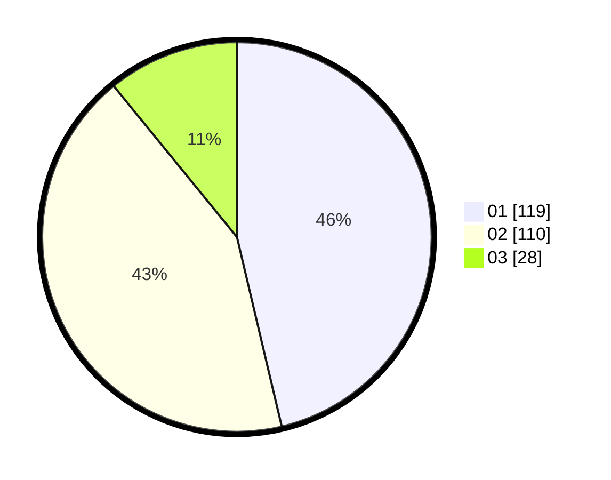

# Hasil

Hasil perolehan suara paslon dapat dilihat pada file paslon-01.txt, paslon-02.txt, dan paslon-03.txt.

Jika tidak ada, artinya data tersebut belum ada pada SIREKAP.

## Perolehan Suara

 * Paslon 01: **119**.
 * Paslon 02: **110**.
 * Paslon 03: **28**.

## Foto C Plano

https://sirekap-obj-formc.kpu.go.id/c221/pemilu/ppwp/31/75/06/10/01/3175061001273-20240214-233205--6b9f261e-b43a-4ec6-bd8c-006996e9d53c.jpg

https://sirekap-obj-formc.kpu.go.id/c221/pemilu/ppwp/31/75/06/10/01/3175061001273-20240214-233451--e9c5d201-53b0-4ebb-bb67-dcfa52cb9c37.jpg

https://sirekap-obj-formc.kpu.go.id/c221/pemilu/ppwp/31/75/06/10/01/3175061001273-20240214-233643--7bac7781-39f2-423e-a35f-b695ccd594c9.jpg

## DATA PEMILIH TETAP

Jumlah pemilih dalam DPT: **290**.
 * L: **140**.
 * P: **150**.

## DATA PENGGUNA HAK PILIH

Jumlah pengguna hak pilih dalam DPT: **246**.
 * L: **122**.
 * P: **124**.

Jumlah pengguna hak pilih dalam DPTb: **5**.
 * L: **3**.
 * P: **2**.

Jumlah pengguna hak pilih dalam DPK: **7**.
 * L: **2**.
 * P: **5**.

Jumlah pengguna hak pilih: **258**.
 * L: **127**.
 * P: **131**.

## JUMLAH SUARA SAH DAN TIDAK SAH

JUMLAH SELURUH SUARA SAH: **257**.

JUMLAH SUARA TIDAK SAH: **1**.

JUMLAH SELURUH SUARA SAH DAN SUARA TIDAK SAH: **258**.
