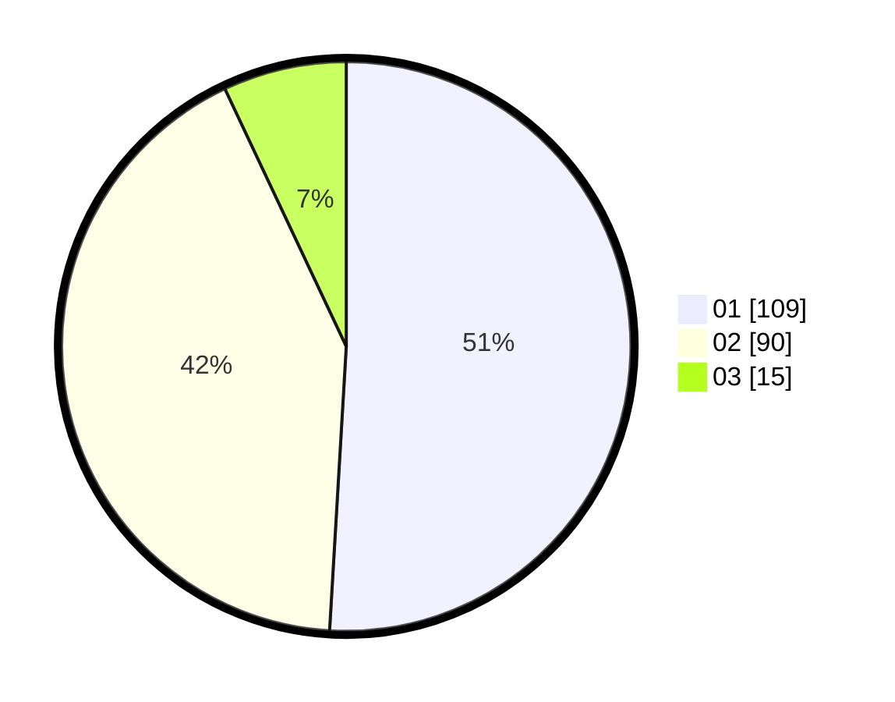

# Hasil

Hasil perolehan suara paslon dapat dilihat pada file paslon-01.txt, paslon-02.txt, dan paslon-03.txt.

Jika tidak ada, artinya data tersebut belum ada pada SIREKAP.

## Perolehan Suara

 * Paslon 01: **109**.
 * Paslon 02: **90**.
 * Paslon 03: **15**.

## Foto C Plano

https://sirekap-obj-formc.kpu.go.id/ae87/pemilu/ppwp/31/75/06/10/01/3175061001282-20240214-201652--17092528-65f1-4b07-9396-55292f5e9e32.jpg

https://sirekap-obj-formc.kpu.go.id/ae87/pemilu/ppwp/31/75/06/10/01/3175061001282-20240214-201516--e0c42d72-e69c-4476-bd10-28af0fde59ad.jpg

https://sirekap-obj-formc.kpu.go.id/ae87/pemilu/ppwp/31/75/06/10/01/3175061001282-20240214-201812--c8b416fe-c241-4434-9b3b-0adfdd196670.jpg

## DATA PEMILIH TETAP

Jumlah pemilih dalam DPT: **273**.
 * L: **133**.
 * P: **140**.

## DATA PENGGUNA HAK PILIH

Jumlah pengguna hak pilih dalam DPT: **215**.
 * L: **106**.
 * P: **109**.

Jumlah pengguna hak pilih dalam DPTb: **0**.
 * L: **0**.
 * P: **0**.

Jumlah pengguna hak pilih dalam DPK: **1**.
 * L: **1**.
 * P: **0**.

Jumlah pengguna hak pilih: **216**.
 * L: **107**.
 * P: **109**.

## JUMLAH SUARA SAH DAN TIDAK SAH

JUMLAH SELURUH SUARA SAH: **214**.

JUMLAH SUARA TIDAK SAH: **2**.

JUMLAH SELURUH SUARA SAH DAN SUARA TIDAK SAH: **216**.
