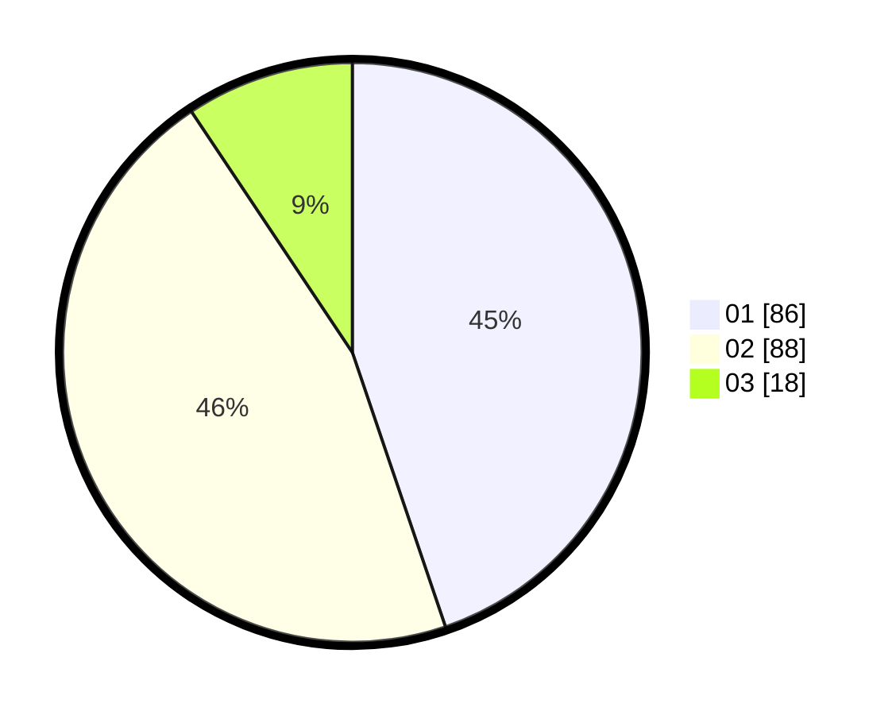

# Hasil

Hasil perolehan suara paslon dapat dilihat pada file paslon-01.txt, paslon-02.txt, dan paslon-03.txt.

Jika tidak ada, artinya data tersebut belum ada pada SIREKAP.

## Perolehan Suara

 * Paslon 01: **86**.
 * Paslon 02: **88**.
 * Paslon 03: **18**.

## Foto C Plano

https://sirekap-obj-formc.kpu.go.id/2541/pemilu/ppwp/31/75/06/10/01/3175061001284-20240214-213319--35dd4f1a-a5a4-4d87-94f1-636c3ddcdf88.jpg

https://sirekap-obj-formc.kpu.go.id/2541/pemilu/ppwp/31/75/06/10/01/3175061001284-20240214-220800--8ad3ef7e-9a3a-4b05-aa55-25d9f23bf961.jpg

https://sirekap-obj-formc.kpu.go.id/2541/pemilu/ppwp/31/75/06/10/01/3175061001284-20240214-220948--767bcaed-7d6d-4eb8-bd2e-69f50e1d23fc.jpg
