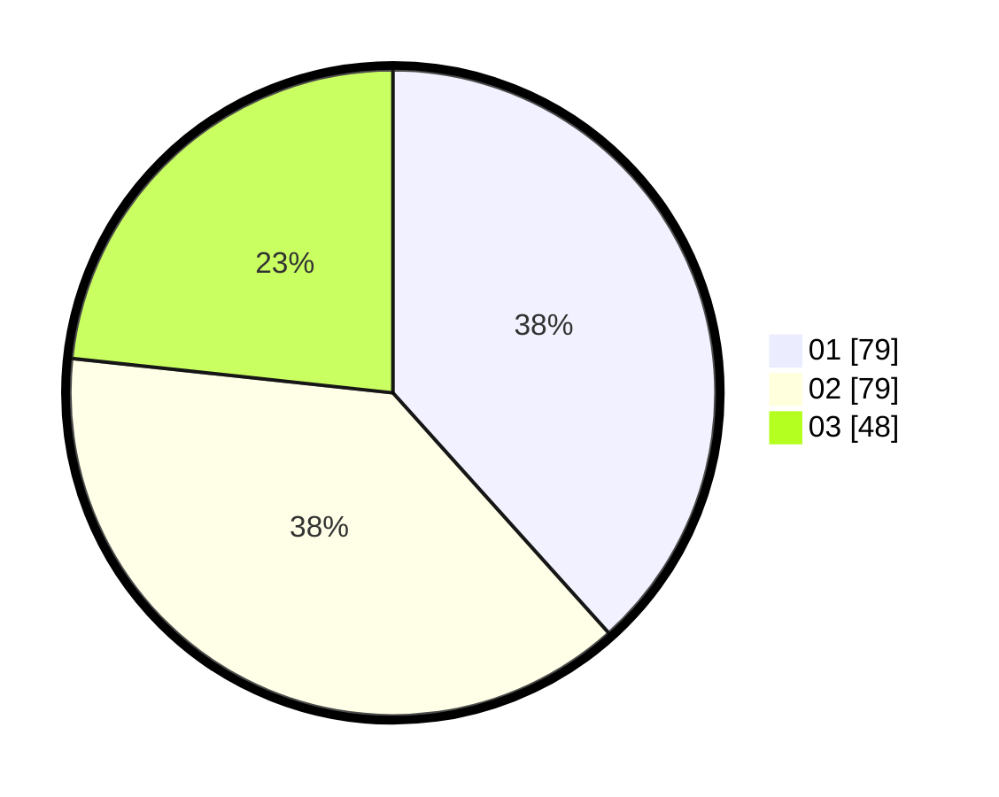

# Hasil

Hasil perolehan suara paslon dapat dilihat pada file paslon-01.txt, paslon-02.txt, dan paslon-03.txt.

Jika tidak ada, artinya data tersebut belum ada pada SIREKAP.

## Perolehan Suara

 * Paslon 01: **79**.
 * Paslon 02: **79**.
 * Paslon 03: **48**.

## Foto C Plano

https://sirekap-obj-formc.kpu.go.id/a5bd/pemilu/ppwp/31/75/06/10/01/3175061001288-20240214-213308--af91a869-59d3-4733-9a34-0ee99901401b.jpg

https://sirekap-obj-formc.kpu.go.id/a5bd/pemilu/ppwp/31/75/06/10/01/3175061001288-20240214-213036--5d986800-6d18-4972-929a-c1f9e3474bd2.jpg

https://sirekap-obj-formc.kpu.go.id/a5bd/pemilu/ppwp/31/75/06/10/01/3175061001288-20240214-213101--9f5e09e5-132e-41f1-b6fe-83cb56d0ad25.jpg

## DATA PEMILIH TETAP

Jumlah pemilih dalam DPT: **265**.
 * L: **141**.
 * P: **124**.

## DATA PENGGUNA HAK PILIH

Jumlah pengguna hak pilih dalam DPT: **210**.
 * L: **109**.
 * P: **101**.

Jumlah pengguna hak pilih dalam DPTb: **0**.
 * L: **0**.
 * P: **0**.

Jumlah pengguna hak pilih dalam DPK: **0**.
 * L: **0**.
 * P: **0**.

Jumlah pengguna hak pilih: **210**.
 * L: **109**.
 * P: **101**.

## JUMLAH SUARA SAH DAN TIDAK SAH

JUMLAH SELURUH SUARA SAH: **206**.

JUMLAH SUARA TIDAK SAH: **4**.

JUMLAH SELURUH SUARA SAH DAN SUARA TIDAK SAH: **210**.
