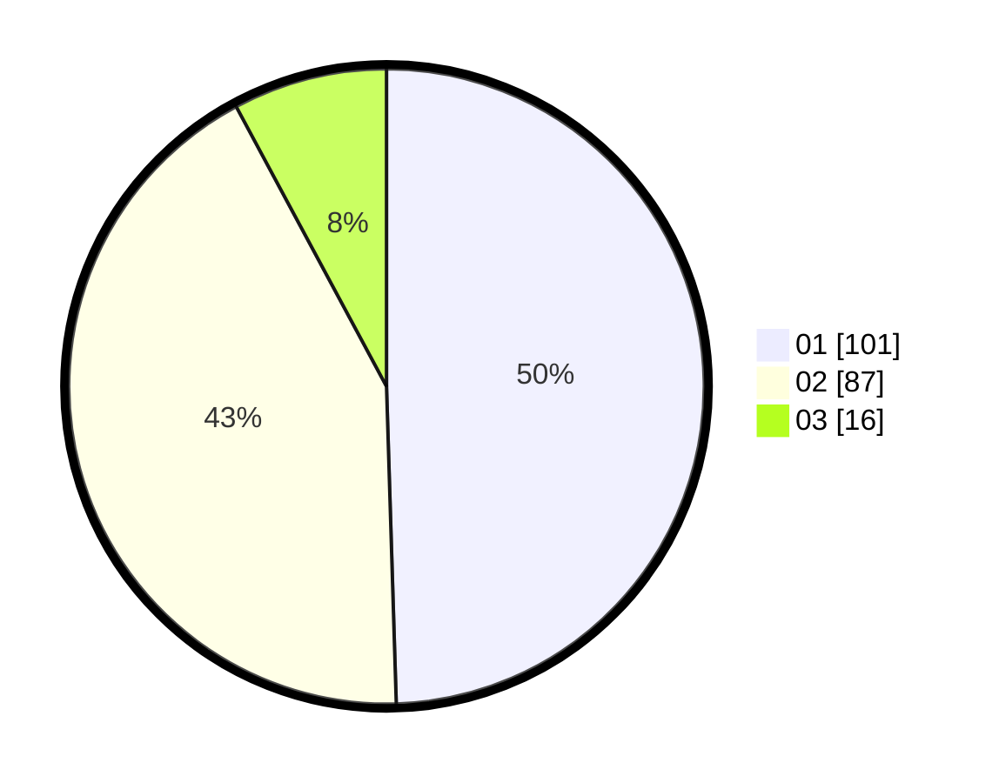

# Hasil

Hasil perolehan suara paslon dapat dilihat pada file paslon-01.txt, paslon-02.txt, dan paslon-03.txt.

Jika tidak ada, artinya data tersebut belum ada pada SIREKAP.

## Perolehan Suara

 * Paslon 01: **101**.
 * Paslon 02: **87**.
 * Paslon 03: **16**.

## Foto C Plano

https://sirekap-obj-formc.kpu.go.id/db7b/pemilu/ppwp/31/75/06/10/02/3175061002003-20240215-004710--39774755-b6de-4e10-a107-5590bee5fb31.jpg

https://sirekap-obj-formc.kpu.go.id/db7b/pemilu/ppwp/31/75/06/10/02/3175061002003-20240215-004739--335c3b41-390b-4fc8-9443-50db192bac57.jpg

https://sirekap-obj-formc.kpu.go.id/db7b/pemilu/ppwp/31/75/06/10/02/3175061002003-20240215-004812--7687d5b9-9511-4996-9048-ac7b2e6e326b.jpg
