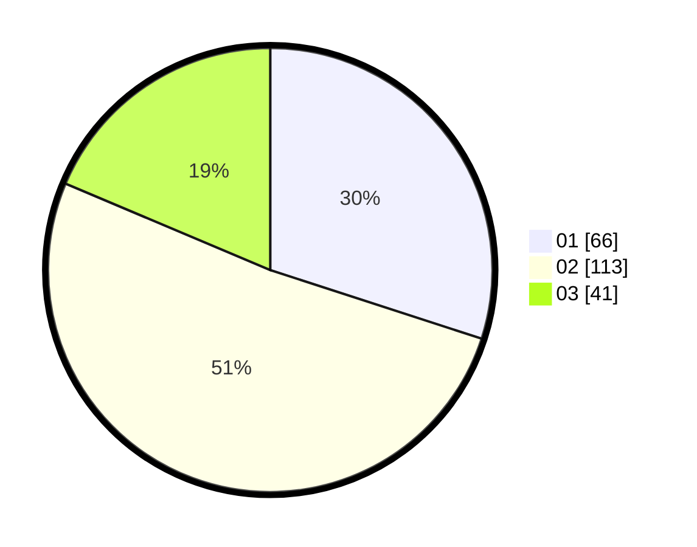

# Hasil

Hasil perolehan suara paslon dapat dilihat pada file paslon-01.txt, paslon-02.txt, dan paslon-03.txt.

Jika tidak ada, artinya data tersebut belum ada pada SIREKAP.

## Perolehan Suara

 * Paslon 01: **66**.
 * Paslon 02: **113**.
 * Paslon 03: **41**.

## Foto C Plano

https://sirekap-obj-formc.kpu.go.id/ff4d/pemilu/ppwp/31/75/06/10/02/3175061002006-20240215-003602--0eae1537-0db3-4482-9ded-b9b46dab3e40.jpg

https://sirekap-obj-formc.kpu.go.id/ff4d/pemilu/ppwp/31/75/06/10/02/3175061002006-20240215-003717--dba2c8d3-b07b-44d5-980e-bd3e820ec863.jpg
