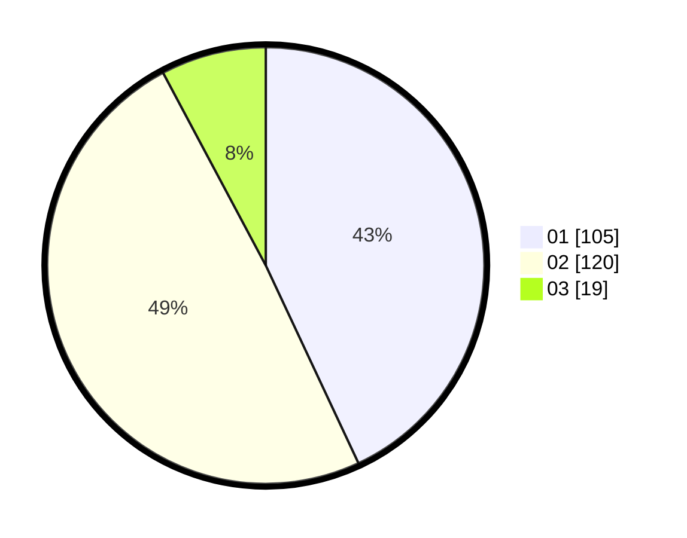

# Hasil

Hasil perolehan suara paslon dapat dilihat pada file paslon-01.txt, paslon-02.txt, dan paslon-03.txt.

Jika tidak ada, artinya data tersebut belum ada pada SIREKAP.

## Perolehan Suara

 * Paslon 01: **105**.
 * Paslon 02: **120**.
 * Paslon 03: **19**.

## Foto C Plano

https://sirekap-obj-formc.kpu.go.id/537e/pemilu/ppwp/31/75/06/10/02/3175061002007-20240215-192810--9ec80886-7f00-486a-81bc-222b3172a5e0.jpg

https://sirekap-obj-formc.kpu.go.id/537e/pemilu/ppwp/31/75/06/10/02/3175061002007-20240215-193849--d4f4e580-2ce7-40dc-a3b4-1c4495a54348.jpg
