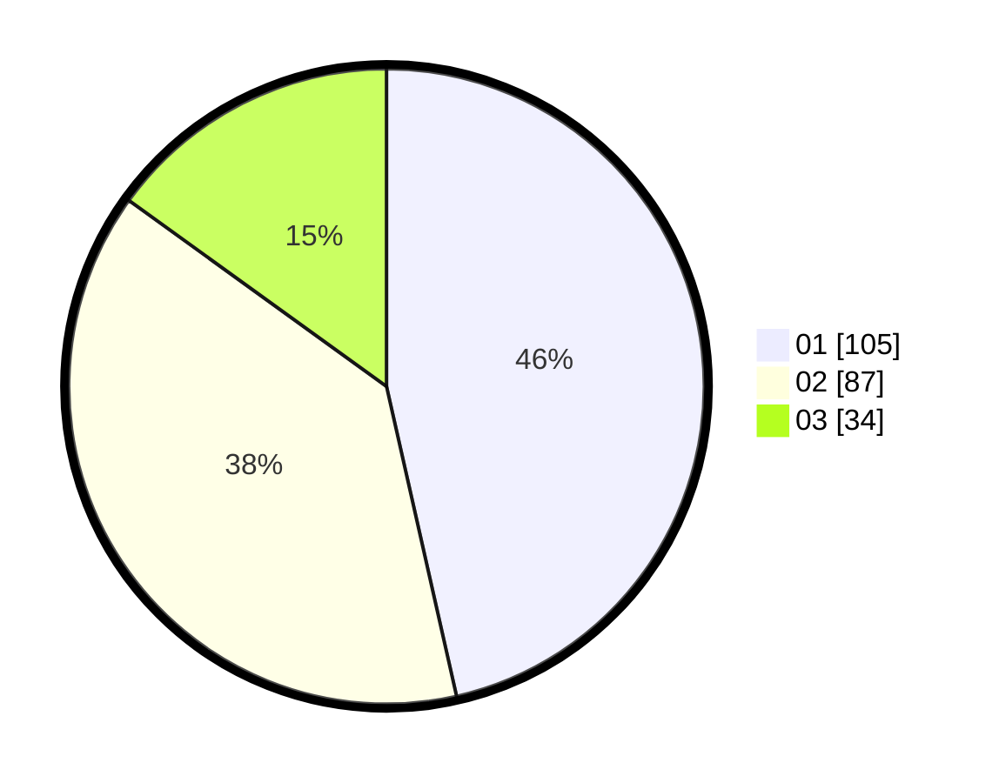

# Hasil

Hasil perolehan suara paslon dapat dilihat pada file paslon-01.txt, paslon-02.txt, dan paslon-03.txt.

Jika tidak ada, artinya data tersebut belum ada pada SIREKAP.

## Perolehan Suara

 * Paslon 01: **105**.
 * Paslon 02: **87**.
 * Paslon 03: **34**.

## Foto C Plano

https://sirekap-obj-formc.kpu.go.id/f5a7/pemilu/ppwp/31/75/06/10/02/3175061002014-20240215-022506--8c0b5031-ba42-47e0-986a-3d11b31f66a8.jpg

https://sirekap-obj-formc.kpu.go.id/f5a7/pemilu/ppwp/31/75/06/10/02/3175061002014-20240215-022338--460622af-11a9-44c2-805f-c16f45fb8c21.jpg

https://sirekap-obj-formc.kpu.go.id/f5a7/pemilu/ppwp/31/75/06/10/02/3175061002014-20240215-033001--8faeea39-23bc-4ab3-ada1-d38433999193.jpg
