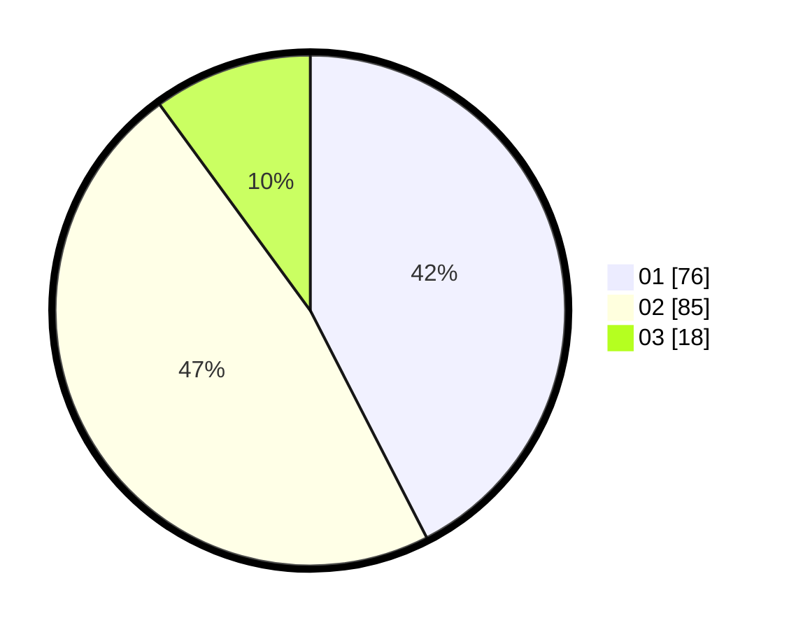

# Hasil

Hasil perolehan suara paslon dapat dilihat pada file paslon-01.txt, paslon-02.txt, dan paslon-03.txt.

Jika tidak ada, artinya data tersebut belum ada pada SIREKAP.

## Perolehan Suara

 * Paslon 01: **76**.
 * Paslon 02: **85**.
 * Paslon 03: **18**.

## Foto C Plano

https://sirekap-obj-formc.kpu.go.id/7a98/pemilu/ppwp/31/75/06/10/02/3175061002017-20240215-063825--f3b40984-f6b2-4071-a550-618b415c84ab.jpg

https://sirekap-obj-formc.kpu.go.id/7a98/pemilu/ppwp/31/75/06/10/02/3175061002017-20240215-063909--779b4ed9-a49b-478f-b006-1d2b68854d62.jpg

https://sirekap-obj-formc.kpu.go.id/7a98/pemilu/ppwp/31/75/06/10/02/3175061002017-20240215-063945--9bcb4485-6b95-4ebf-9aa4-b0d8dbd7d919.jpg

## DATA PEMILIH TETAP

Jumlah pemilih dalam DPT: **290**.
 * L: **147**.
 * P: **143**.

## DATA PENGGUNA HAK PILIH

Jumlah pengguna hak pilih dalam DPT: **177**.
 * L: **89**.
 * P: **88**.

Jumlah pengguna hak pilih dalam DPTb: **2**.
 * L: **1**.
 * P: **1**.

Jumlah pengguna hak pilih dalam DPK: **2**.
 * L: **0**.
 * P: **2**.

Jumlah pengguna hak pilih: **181**.
 * L: **90**.
 * P: **91**.

## JUMLAH SUARA SAH DAN TIDAK SAH

JUMLAH SELURUH SUARA SAH: **179**.

JUMLAH SUARA TIDAK SAH: **2**.

JUMLAH SELURUH SUARA SAH DAN SUARA TIDAK SAH: **181**.
