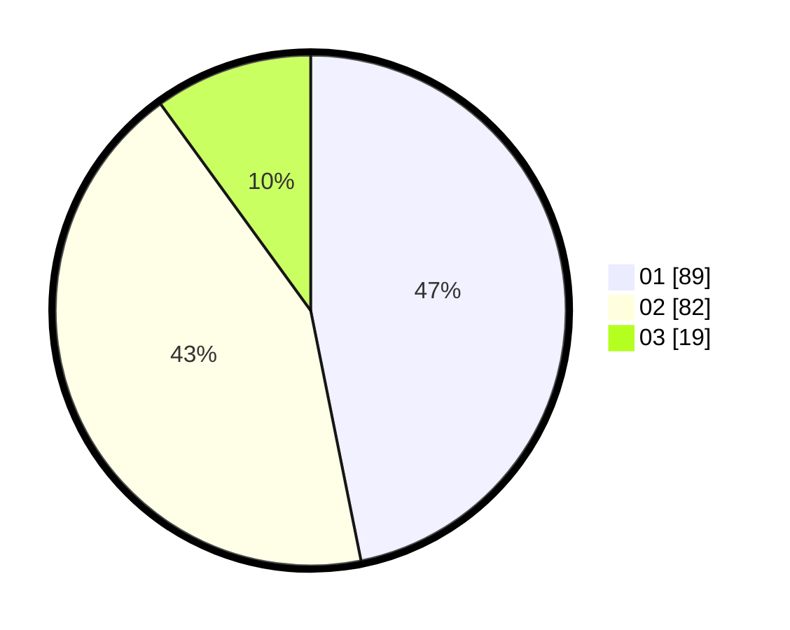

# Hasil

Hasil perolehan suara paslon dapat dilihat pada file paslon-01.txt, paslon-02.txt, dan paslon-03.txt.

Jika tidak ada, artinya data tersebut belum ada pada SIREKAP.

## Perolehan Suara

 * Paslon 01: **89**.
 * Paslon 02: **82**.
 * Paslon 03: **19**.

## Foto C Plano

https://sirekap-obj-formc.kpu.go.id/9c62/pemilu/ppwp/31/75/06/10/02/3175061002020-20240214-230745--fe6b1463-9fee-445b-8983-43b6e538af56.jpg

https://sirekap-obj-formc.kpu.go.id/9c62/pemilu/ppwp/31/75/06/10/02/3175061002020-20240214-231208--884f3eeb-9a3c-49f8-82b3-a63da6ce41d8.jpg
