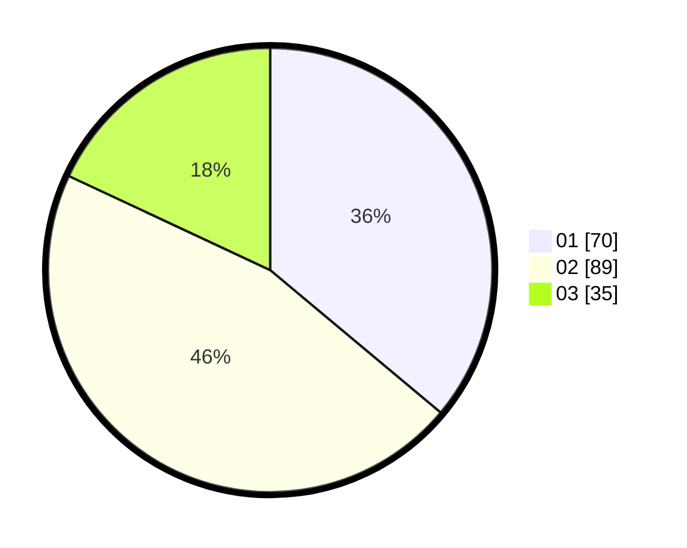

# Hasil

Hasil perolehan suara paslon dapat dilihat pada file paslon-01.txt, paslon-02.txt, dan paslon-03.txt.

Jika tidak ada, artinya data tersebut belum ada pada SIREKAP.

## Perolehan Suara

 * Paslon 01: **70**.
 * Paslon 02: **89**.
 * Paslon 03: **35**.

## Foto C Plano

https://sirekap-obj-formc.kpu.go.id/fa11/pemilu/ppwp/31/75/06/10/02/3175061002023-20240215-145552--c0882c02-964e-4a23-843e-7eb1b508c6b7.jpg

https://sirekap-obj-formc.kpu.go.id/fa11/pemilu/ppwp/31/75/06/10/02/3175061002023-20240215-145708--a12e24f8-87b5-4932-98c0-7a5cb427c2dc.jpg
